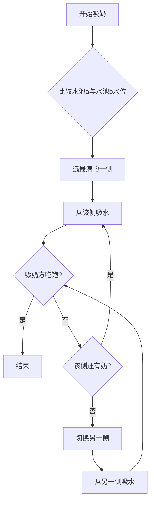

# 泌乳系统 · 水池模型设计规格

**术语**：**Lactating hediff** = RimWorld 中的「泌乳」健康状态（Hediff），挂在 pawn 身上表示当前处于泌乳期；本 mod 使用 `HediffDefOf.Lactating`（或带 Comp 的扩展版），用于驱动产奶、健康/心情等逻辑。规格中「移除 Lactating」即移除该 hediff，泌乳期结束。

**符号**：**L** = 当前泌乳量（唯一状态量），**E** = 有效药效系数 = max(1−耐受, 0.05)，**B** = 基础值（= 总容量），**B_T** = 基础值_T = 3，**k** = 负反馈系数；**D(L,E)** = 每日衰减 = 1/(B_T×E) + k×L。

**目录**：〇 规格与旧实现对比 · 一 核心公式 · 二 吸奶与挤奶 · 三 其他规则与健康 · 四～六 流程图与数据流 · 七 已定结论 · 八 吃药累加 · 九 待定与实现前约定 · 十 未定义与待办 · 十一 当前代码对照（已压缩） · 十二 审查意见 · 十三 实现状态与待办 · 十四 数学与稳态分析 · 十五 代码审查与清理 · 十六 规格验证 · 十七 建议、优化与扩展

---

## 〇、规格与旧实现对比（历史对照）

**说明**：当前代码已按水池模型实现。下表为设计阶段「水池模型 vs 旧实现」的对照，仅作档案保留；实现时已替换为双池、L 驱动、吸收延迟、满池撑大/溢出/回缩、选侧等。

| 项目 | 水池模型设计 | 当前代码实现 | 差异 |
|------|--------------|--------------|------|
| **水池数量/池状态** | 左乳(水池a) + 右乳(水池b)，独立 | `CompEquallyMilkable.fullness`（0~maxFullness），**单池**，无左右分池 | ❌ 当前无左右分池 |
| **总水池开启时间** | 吸收延迟（由身体代谢能力决定） | 无；吃药后立即加 Lactating | ❌ 无吸收延迟 |
| **总水池存在时间** | **L 驱动**：仅维护当前泌乳量 L；**泌乳结束条件**为 **L ≤ 0**。剩余天数不再独立存储与递减，改为由 L 动态预测：**剩余天数 ≈ L / (1/(基础值_T×E) + k×L)**（E = 有效药效系数，k = 负反馈系数）。 | 无单独「剩余天数」；Lactating 的 `SeverityChangePerDay()`：成瘾且满足 → 0，否则 **-0.1×(1+耐受)**；severity 扣到 0 即结束 | ❌ 存在时间算法不同 |
| **进水公式** | **每次吃药**：L += 基础值×有效药效系数（离散事件）；**每游戏日**：**L −= [ 1/(基础值_T×E) + k×L ]**，且 **L = max(0, L)**。进水流速 = L×饥饿系数。引入 **k×L** 避免 L 线性无限增长，系统存在自然稳态。 | 每 30 tick：`fullness += ...`；**满池时直接 return，不进水** | ❌ 进水逻辑不同 |
| **Lactating severity / 当前泌乳量** | 当前泌乳量为累计值，每次吃药 += 基础值×有效药效系数 | 吃药通过 `IngestionOutcomeDoer_GiveHediff` 加 severity（0.5 或 2）；`TryMergeWith` 时 **Severity += other.Severity** 累加 | ✅ 概念对应（累加） |
| **满池时进水** | 撑大乳房→容量暂增，超限溢出/漏奶 | 满池(`fullness==maxFullness`)时直接不进水 | ❌ 满池停进，无撑大/溢出 |
| **容量** | 水池a/b 容量 = 种族×左/右乳大小；总容量=a+b | MilkAmount = 种族 milkAmount × GetMilkAmountFactorWithTolerance(severity,耐受)；无「乳房大小」、无分侧 | ❌ 无左右容量、无显式乳房大小 |
| **挤奶间隔** | 由 容量/进水 推导 | `MilkIntervalDays()` = 种族 `milkIntervalDays`（如 0.25 天），**固定** | ❌ 间隔固定，非推导 |
| **吸奶顺序/挤奶** | 先吸最满一侧，再吸另一侧，吸饱即停 | 单一 fullness/Charge，GreedyConsume，无「先吸最满一侧」；`SetMilkFullness` 可吸空 | ❌ 无左右选择逻辑；✅ 允许吸空 |
| **吸奶量** | 由吸奶方是否吃饱决定 | `toConsume = Min(toConsumeInTicks, wanted)`，wanted 来自需求 | ✅ 已按需求限制 |
| **进出水同步** | 排水时进水不停 | 满池时停进水，吸奶时若满则之前已停 | ❌ 未做到边排边进 |
| **完全吸空** | 允许 | 允许，SetMilkFullness(0f) | ✅ 一致 |
| **饥饿降流速** | 按饥饿程度降低流速 | BodyResourceGrowthSpeed 参与 GrowthMultiplier，饥饿为 0 则停 | ✅ 有 |
| **成瘾满足** | L 驱动：L 仍按 1/(B_T×E)+k×L 每日衰减；泌乳结束仅看 L≤0。 | `HediffComp_EqualMilkingLactating.SeverityChangePerDay()` 中 addiction.CurStageIndex==0 时 return 0 | ✅ 概念对应 |
| **分娩** | 开一个基础阀 | 需别处添加 Lactating hediff（未在 Comp 内） | ✅ 概念有 |
| **耐受作用** | 有效药效系数 max(1−耐受, 0.05)，参与时间与进水 | `GetProlactinTolerance` = EM_Prolactin_Tolerance.Severity；GetMilkAmountFactorWithTolerance / GetLactatingEfficiencyFactorWithTolerance 用 (1-t) | ✅ 方向一致 |

---

## 一、核心公式

| 项目 | 公式 | 说明 |
|------|------|------|
| **有效药效系数** | **max(1 − 耐受, 0.05)** | 参与存在时间与进水，满耐受时保留至少 5% 效果，符合「耐受=效果变弱而非归零」 |
|  吃药后延迟多久开始总水池开启时间 | 吸收延迟（使用 RimWorld Genes 代谢率：代谢率低起效慢、高起效快）。延迟内不挂 Lactating，开始进水时再给 hediff。 |进水。**已定**：吸收延迟**内不挂 Lactating hediff**，**开始进水时再给予** Lactating hediff（即「水池开启」与 hediff 同步）。
| **剩余天数（仅作显示/预测）** | **不再独立存储与递减**。由 L 动态预测：**剩余天数 ≈ L / (1/(基础值_T×E) + k×L)**（L > 0 且分母 > 0 时）；L ≤ 0 时为 0。与 L 及泌乳结束逻辑一致。 | 实现时可为只读属性，按上式由当前 L 与 E、k 计算。 |
| **当前泌乳量 L（唯一状态量）** | **每次吃药**（离散事件）：**L += 基础值×有效药效系数**；**每游戏日**：**L −= [ 1/(基础值_T×E) + k×L ]**，且 **L = max(0, L)**。**泌乳结束条件**：**L ≤ 0**（停止进水、重置状态、移除 Lactating）。 | 避免 L 线性无限增长；引入 k×L 后系统指数收敛、存在自然稳态，无需硬封顶。 |
| **每天衰减（当前泌乳量）** | **每天衰减 = 1/(基础值_T×E) + k×L**（E = 有效药效系数，**k = 负反馈系数**，由实现/调参定）。L 越大衰减越强，收敛时间 τ ≈ 1/k（游戏日）。 | 稳态 L* 由服药频率、B、E 与 k 共同决定；k 可根据期望稳态或期望 τ 反推。 |
| 水池 a 进水流速 | 当前泌乳量 × 饥饿系数 | 左乳产奶流速；**若只有一侧有乳房，则水池 b 为 0 或不存在** |
| 水池 b 进水流速 | 当前泌乳量 × 饥饿系数 | 右乳产奶流速 |
| **进水受饥饿影响** | **饥饿系数 ∈ [0,1]** | 饥饿越高系数越低，为 0 时停止进水；**机械体使用「能量充足系数」替代饥饿系数** |
| 水池 a 容量 | 种族 × 左乳大小 | 不可变（某时刻），泌乳期会增大乳房→容量变 |
| 水池 b 容量 | 种族 × 右乳大小 | 同上；单侧乳房时 b 为 0 或不存在 |
| 总容量 | 水池 a 容量 + 水池 b 容量 | 两池容量之和；**不设封顶**；进水/存在时间亦不封顶 |

**按本逻辑的变满时间（每侧单独算）：**  
每个乳房单独进水、单独容量。**水池 a 进水流速** = 当前泌乳量×饥饿系数，**水池 b 进水流速** = 当前泌乳量×饥饿系数（规格中左右流速相同，仅容量可左右不同）。  
⇒ **单侧变满时间 = 该侧容量 ÷ (当前泌乳量 × 饥饿系数)**（水池 a：种族×左乳大小 ÷ (当前泌乳量×饥饿系数)；水池 b：种族×右乳大小 ÷ (当前泌乳量×饥饿系数)）。  
左右乳大小若不同，两侧变满时间不同；「两边都满」= 较慢那一侧变满的时间。总容量 = 水池a容量 + 水池b容量 仅表示两池容量之和，不改变「每侧单独算」的结论。

**假设吃一次药（数值例）：**  
设 耐受=0（有效药效系数=1）、饱腹（饥饿系数=1）。吃一次药后 当前泌乳量 = 基础值，**单侧**进水流速 = 基础值，故 **单侧变满时间 = 该侧容量 ÷ 基础值**（游戏日）。  

**已定**：**基础值 = 总容量**；**基础值_T = 3**（参与衰减分母 1/(基础值_T×E)，与 k 共同决定每天衰减及剩余天数预测）；**基础值_T_分娩 = 10**（游戏日，**分娩**时 L 增量对应的自然泌乳期参考）。单侧变满时间（恢复时间）= **0.5 游戏日**（约 12 小时）。实现时按此取值即可。  

（若左右乳大小相同，则 单侧容量 = 总容量/2，单侧变满时间 = (总容量/2)÷总容量 = 0.5 游戏日。其他比例参考：基础值 = 2×总容量 → 0.25 天；基础值 = 0.5×总容量 → 1 天。）

**耐受**：**0~1**，越高药效越弱；**初始耐受 = 0**（未吃过药时）。**进水与衰减**使用 **有效药效系数 E** = max(1 − 耐受, 0.05)，满耐受时仍保留至少 5% 效果。**每次吃药**耐受增加：催乳素（Prolactin）**+0.044**、Lucilactin **+0.176**（体型 1.0 时；体型≠1 时按 divideByBodySize 分摊，由实现定）。**停药后耐受每日自然恢复 -0.015**（纳入规格）。

### 负反馈系数 k 与调参

- **k**（负反馈系数）：每天衰减 = 1/(基础值_T×E) **+ k×L**。k 越大，L 收敛越快，稳态 L* 越低；**收敛时间常数 τ ≈ 1/k**（游戏日）。
- **调参建议**：可根据**期望稳态 L*** 或**期望收敛时间 τ** 反推 k，并与 B、基础值_T、E、平均服药频率协同优化；实现后需体验调优。

### 成瘾 / 戒断与泌乳结束

- **泌乳结束**：仅由 **L ≤ 0** 判定（重置状态、移除 Lactating）。不再使用独立「剩余天数」扣减。
- **成瘾满足**：仍按上述公式对 L 做每日衰减（1/(B_T×E) + k×L）；成瘾满足不再单独「不扣剩余天数」。若需成瘾满足时延长可持续时间，可由提高 L 的输入（服药频率/剂量）或调小 k 体现。

---

## 二、吸奶与挤奶逻辑

1. **吸奶**：先吸**最满的一侧**，再吸**另一侧**，**吸饱就不吸了**（吸奶量由吸奶方饱食度决定）。**两侧水位相同时**（如都空或都满）先吸**容量大**的一侧；容量也相同时**已定**：**男左女右**（男性先左侧、女性先右侧）。
2. **挤奶顺序与吸奶一致**：先挤最满的一侧，再挤另一侧；两侧水位相同时先挤容量大的一侧；容量也相同时同样男左女右。

---

## 三、其他规则

- **状态量**：仅维护**当前泌乳量 L**。**每次吃药**（离散事件）：**L += 基础值×有效药效系数**；**每游戏日**：**L −= [ 1/(基础值_T×E) + k×L ]**，且 **L = max(0, L)**。**泌乳结束条件**：**L ≤ 0**（停止进水、重置、移除 Lactating）。**剩余天数**不再独立存储与递减，由 L 动态预测：**剩余天数 ≈ L / (1/(基础值_T×E) + k×L)**（仅作显示）。
- **进水受饥饿影响**：进水流速 = L×饥饿系数；饥饿程度越高系数越低，为 0 时停止进水；**机械体使用能量充足系数**。
- **成瘾满足**：L 仍按上式每日衰减；泌乳结束仅看 L≤0。若需「成瘾满足时更持久」，由服药频率/剂量或调参 k 体现。
- 满池进水：暂时撑大乳房（像气球），超限**溢出/漏奶**；**溢出或漏奶时生成地面污物，不扣除水池已有水位**（即水池量不变，仅产生污物）。
- 允许完全吸空
- 进出水同步进行
- 不允许多个同时吸奶
- 分娩：**进入泌乳期**，开一个基础阀。**已定**：**L += 基础值**（总容量），**不乘有效药效系数**。**若当前已在药物泌乳期，分娩与药物泌乳叠加**（L 在现有基础上 +基础值，不覆盖）。剩余天数由 L 按上式预测，不再单独「剩余天数 += 10」。
- 多乳：左右独立水池；**单侧乳房时水池 b 容量/进水为 0 或不存在**
- **催乳剂 Galactogogues**：仅在**已有泌乳时**使用的补充剂，暂时提高乳腺活性，约 3 天内产奶量增加；水池模型里体现为**临时提高进水基础值或额外阀门**（具体倍率/时长按实现）。*当前代码*：物品 `Cumpilation_Galactogogues`，服用后给予 Hediff `Cumpilation_ActiveMammaries`（severity 1.0，每日 −0.33，约 3 天消退），该 hediff 通过 `HediffCompProperties_FluidAmountChange` 对乳房产奶量乘数 1.4（multiplier），即临时提高产奶量约 40%。
- **基因（永久泌乳、奶类型等）**：体现为「默认开 N 个阀」或「基础值/容量倍率」。

### 健康影响（纳入规格）

- **饥饿率**：泌乳且未满池时，按当前泌乳/进水状态增加饥饿率（更易饿）；满池时不额外增加。机械体用同逻辑增加能量消耗。
- **意识/操纵/移动**：仅**药物诱发泌乳**（有耐受或成瘾）时，可给予 Consciousness、Manipulation、Moving 增益（具体倍率/开关由实现定）；分娩等非药物泌乳无此增益。
- **生育率**：泌乳期可设生育率修正（如 0.05），与产奶逻辑独立，由实现定。
- **其它健康影响（如乳腺炎、堵塞等）**：泌乳期可扩展其它健康状态（如乳腺炎、堵塞等）。**已定**：可由**长时间满池、卫生、受伤**等触发；影响**进水流速或容量**，或产生**负面心情/健康**；具体 hediff 与数值由实现或后续扩展定。
- **产奶量/效率**：由水池「进水流速」「容量」及当前泌乳量×饥饿系数决定，不在此单独列项。

### 心情/记忆（纳入规格）

- **强制挤奶**：挤奶者不在产主的「允许吸奶」名单内时，产主（被挤奶者）获得**负面记忆**（如 `EM_ForcedMilking`）。实现时按此条件触发。
- **伴侣食用产主的奶/精液制品**：食用者为产主伴侣（Lover）时，产主获得**正面记忆**（如 `EM_PartnerAteMyProduct`）。
- **性行为中泌乳**：若设置开启，性行为中 initiator/partner 若为泌乳者则获得记忆（如 `EM_HadSexWhileLactating`）。具体开关由实现定。
- **催乳素相关心情（愉悦/戒断/高量等）**：可定义催乳素愉悦、戒断、高量等记忆（如 `EM_Prolactin_Joy`、`EM_Prolactin_Withdrawal`、`EM_Prolactin_HighThought`）；触发时机可由实现或后续扩展约定（当前代码中仅 Def 引用、未见触发给记忆）。
- **挤奶/吸奶/吃药/戒断对心情的进一步细分**：可区分「被允许的人挤奶」正面、「成瘾满足」正面等；具体是否实现及效果由实现定。
- **满池/空池、长时间未挤奶等对心情或健康的差异化影响**：可对满池、空池、长时间未挤奶等状态给予不同心情或健康影响；具体由实现定。

### 满池撑大与排水后回缩

- **基础容量**：种族×乳房大小（未撑大时的容量）。**撑大**：满池继续进水时暂时允许超过基础容量；排水后超出部分缓慢回缩。
- **恢复时间**：排水后回缩到基础容量 = **0.5 游戏日**（见第七节已定）。
- **回缩公式（建议）**：每游戏日 `当前容量 = 基础容量 + (当前容量 - 基础容量) × (1 - 回缩率)`，回缩率 0.5～1。长期满池可不回缩或极慢回缩，由实现定。

*参考（旧实现）*：当前代码变满约 0.25～1 游戏日（G=GrowthMultiplier）；水池模型下单侧变满 = 该侧容量÷(当前泌乳量×饥饿系数)，基础值=总容量时 0.5 游戏日。

## 四、流程图

```mermaid
flowchart TB
    subgraph 触发["触发阶段"]
        A[吃药] --> B[吸收延迟]
        B --> C{水池开启}
        D[分娩] --> C
    end

    subgraph 进水["进水阶段"]
        C --> E[每次吃药: 当前泌乳量 += 基础值×有效药效系数]
        E --> F[水池a/b 进水流速 = 当前泌乳量×饥饿系数]
        F --> G[水池a 水位↑]
        F --> H[水池b 水位↑]
    end

    subgraph 容量["容量"]
        I[水池a容量 = 种族×左乳大小]
        J[水池b容量 = 种族×右乳大小]
        K[总容量 = a容量 + b容量]
        I --> K
        J --> K
    end

    subgraph 出水["出水阶段"]
        L{吸奶/挤奶}
        L --> M{选最满的一侧}
        M --> N[先吸该侧]
        N --> O[吸饱?]
        O -->|否| P[吸另一侧]
        P --> O
        O -->|是| Q[停止]
    end

    subgraph 满池["满池处理"]
        G -.->|满| R[暂时撑大乳房]
        H -.->|满| R
        R --> S{超限?}
        S -->|是| T[溢出/漏奶]
        S -->|否| G
    end

    subgraph 时长["存在时间（L 驱动）"]
        U[每次吃药: L += 基础值×有效药效系数]
        V[每游戏日: L −= 1/(B_T×E) + k×L]
        W[L≤0 → 停止进水、重置]
        U --> V --> W
    end

    G --> L
    H --> L
```

---

## 五、吸奶顺序详细流程图



---

## 六、数据流总览

```mermaid
flowchart LR
    subgraph 输入
        X1[当前泌乳量 L]
        X2[耐受]
        X3[种族]
        X4[乳房大小]
    end

    subgraph 计算
        Y0[有效药效系数 = max(1-耐受, 0.05)]
        Y1[每次吃药: L += 基础值×有效药效系数]
        Y2[每游戏日: L −= 1/(B_T×E)+k×L；剩余天数 = L/日衰减]
        Y3[容量 = 种族×乳房大小]
    end

    subgraph 输出
        Z1[水池a水位]
        Z2[水池b水位]
    end

    X1 --> Y1
    X1 --> Y2
    X2 --> Y0
    Y0 --> Y1
    Y0 --> Y2
    X3 --> Y3
    X4 --> Y3
    Y1 --> Z1
    Y1 --> Z2
```

---

## 七、审阅建议与已定结论

以下为实现时已定结论（审阅后确定）。

| 条 | 建议 / 已定 | 说明 |
|----|-------------|------|
| **存在时间与衰减** | **已定**：**L 驱动**。仅维护**当前泌乳量 L**；每次吃药 **L += 基础值×有效药效系数**；每游戏日 **L −= [ 1/(基础值_T×E) + k×L ]**，且 L = max(0,L)。**泌乳结束**：**L ≤ 0**（重置、移除 Lactating）。**剩余天数**不再独立存储，由 **L / (1/(B_T×E) + k×L)** 动态预测（仅作显示）。 | 与第一节一致。 |
| **耐受 = 1 时** | **已定**：采用 **有效药效系数** = max(1−耐受, 0.05)，存在时间与进水均用该系数，满耐受时保留至少 5% 效果。见第一节。 | 不再断崖到 0。 |
| **吃药次数** | **已定**：**实现上不必单独维护「吃药次数」**。每次吃药 **L += 基础值×有效药效系数**；进入新泌乳期时重置 L（与水池水位）。若需显示「本周期吃了多少次」可另行统计。 | 简化逻辑见第八节。 |
| **左右池进水** | **已定**：只影响容量、不影响流速。两侧产奶流速相同，容量由左右乳大小决定。 | 保持公式不变。 |
| **满池撑大容量** | **建议**：排水后**缓慢回缩**到基础容量。**恢复时间（回缩到基础容量）= 0.5 游戏日**（约 12 小时）；每游戏日将超出部分按比例减少，由实现达到该时间量级。长期持续满池可不回缩或极慢回缩，由实现定。 | 避免永久变大未定义。 |
| **成瘾后存在时间** | **已定**：L 仍按上式每日衰减；泌乳结束仅看 **L≤0**。成瘾满足不再单独「不扣」；若需更持久由服药频率或调参 k 体现。 | 与第一节一致。 |
| **泌乳结束重置** | **已定**：**L ≤ 0** 时停止进水，并**重置状态**（L、水池水位清零，移除 Lactating hediff）；下次吃药或分娩视为新泌乳期。 | 与第一节、第九节一致。 |
| **基础值_T** | **已定**：**基础值_T = 3**（参与衰减分母 1/(基础值_T×E)）；**基础值_T_分娩 = 10**（**分娩**时 **L += 基础值**，不乘有效药效系数）。剩余天数由 L 预测，不再单独「剩余天数 += 10」。 | 与第一节、第八节一致。 |

---

## 八、吃药次数与效果累加（简化逻辑）

**当前泌乳量 L**是**唯一状态量**。每次吃药时：
- **L += 基础值×有效药效系数**（本次增量 = 基础值×有效药效系数，用**当前**耐受算）；
- **耐受**增加：吃 **EM_Prolactin** 时 +0.044、吃 **EM_Lucilactin** 时 +0.176（体型 1.0 时；体型≠1 时按 divideByBodySize 分摊，与当前代码一致）。

**进水流速** = L × 饥饿系数。  
**每游戏日**：**L −= [ 1/(基础值_T×E) + k×L ]**，且 L = max(0,L)；**剩余天数**由 **L / (1/(B_T×E) + k×L)** 预测（仅显示）；耐受若停药则每日恢复 -0.015。  
**吃药次数**不必单独维护；若需显示「本泌乳期吃了多少次」可另行统计。

---

## 九、待定 / 实现前约定

| 类别 | 内容 |
|------|------|
| **吸收延迟** | **已定**：使用 RimWorld **Genes 代谢率**；代谢率低起效慢、高起效快。具体换算（代谢→延迟天数或 tick）由实现定。延迟内不挂 Lactating hediff，开始进水时再给予 hediff。 |
| **满池撑大与溢出** | 恢复时间 0.5 游戏日（见第七节）。**溢出/漏奶**：生成地面污物，**不扣除水池已有水位**。 |
| **吸奶/挤奶耗时** | 吸奶时间与挤奶时间与容量/流速的关系未量化。 |
| **动物/非人类种族** | 种族×乳房大小、成年雌性动物「始终泌乳」开关等未展开；**机械体**是否参与挤奶/吸奶、仅产奶与能量消耗等未统一；**超过两乳**（如四乳）水池数量与分配未约定。 |
| **基础值_T 与 基础值_V** | **进水**用「基础值」：每次吃药 **L += 基础值×有效药效系数**，进水流速 = L×饥饿系数。**衰减**：每游戏日 **L −= 1/(基础值_T×E) + k×L**；**分娩**时 **L += 基础值**（不乘有效药效系数）。**已定**：**基础值_T = 3**；**基础值_T_分娩 = 10**（分娩 L 增量参考）。基础值 = 总容量（已定）；**剩余天数**由 L 动态预测。 |
| **泌乳结束与重置** | **已定**：**L ≤ 0** 时停止进水并**重置状态**（L、水池水位清零，移除 Lactating hediff）；引入 k×L 后 L 存在自然稳态，无需硬封顶。 |
| **UI/显示** | 双池水位、剩余天数、当前泌乳量是否对玩家可见、如何展示（如 hediff 悬停、信息面板、表格列等）由实现定。 |
| **心情/记忆与健康** | 心情/记忆见第三节「心情/记忆」，健康影响见第三节「健康影响」；其余细分（见下）待定或由实现定。 |

---

## 十、未定义清单（实现前需约定）

以下为规格中**尚未完全定义**、需在实现前或实现中约定的项，按类别整理便于逐条拍板。

### 10.1 时间与数值

| 项 | 说明 | 约定/建议 |
|----|------|----------|
| **吸收延迟** | 由身体代谢能力决定，**代谢 → 延迟天数/tick** 的换算公式未定。 | **已定**：使用 RimWorld **Genes 代谢率**（Metabolic efficiency）；代谢率低起效慢、高起效快。延迟内不挂 Lactating，开始进水时再给 hediff。 |
| **吸奶/挤奶耗时** | 吸奶时间、挤奶时间与容量/流速的关系**未量化**。 | **已定**：先**沿用当前代码的固定时长**。后续是否按容量/流速量化列入**待办**。 |
| **满池回缩公式** | 回缩率与「0.5 游戏日回缩到基础容量」的对应关系；按**身体健康度**回缩。 | **已定**：按**身体健康度**进行回缩。**建议**：每游戏日回缩量 = (当前容量 − 基础容量) × 回缩率 × 身体健康度系数；身体健康度越高回缩越快（身体好恢复快），约 0.5 游戏日回缩到基础容量时取回缩率与健康系数乘积在 0.5～1 量级。实现时可用 `pawn.health.summaryHealth.SummaryHealthPercent` 或等价健康度。 |
| **第 1 次吃药是否乘有效药效系数** | 剩余天数/当前泌乳量：第 1 次与第 N 次是否一致。 | **已定**：规格统一为**每次均 × 有效药效系数**（含第 1 次）。 |

### 10.2 选侧与顺序

| 项 | 说明 | 约定/建议 |
|----|------|----------|
| **两侧水位相同时选哪侧** | 吸奶/挤奶时两侧都空或都满、且容量也相同时，先吸/挤哪一侧。 | **已定**：**男左女右**（男性 pawn 先左侧、女性 pawn 先右侧）。 |

### 10.3 种族、机械体、多乳

| 项 | 说明 | 约定/建议 |
|----|------|----------|
| **动物/非人类种族** | 种族×乳房大小、成年雌性动物「始终泌乳」等**未展开**。 | **已定**：先**沿用当前代码**的 GetDefaultMilkProduct、isMilkable、femaleAnimalAdultAlwaysLactating 等。后续细化列入**待办**。 |
| **机械体** | 是否参与挤奶/吸奶、仅产奶与能量消耗等。 | **已定**：**先不做**。是否实现列入**待办**，由作者考虑后决定。 |
| **超过两乳（如四乳）** | 水池数量、容量与进水分配**未约定**。 | **已定**：**N 乳 = N 个池**，容量按部位分配。 |

### 10.4 分娩、催乳剂、溢出

| 项 | 说明 | 约定/建议 |
|----|------|----------|
| **分娩具体数值** | 分娩 = 自然生育触发的泌乳；**游戏/RJW 中的实现与时间**。 | **已定**：分娩 = **自然泌乳**。**L += 基础值**（总容量），**不乘**有效药效系数。**当前实现**：RJW 分娩时添加 Lactating；规格采用 基础值_T_分娩=10 作参考（剩余天数由 L 预测）。 |
| **催乳剂与累加** | 催乳剂与当前泌乳量累加的关系、结束时是否回退。 | **已定**：**临时倍率**（如 ×1.4）；结束时**只撤倍率、不扣当前泌乳量**。持续时长沿用当前代码约 3 天。 |
| **溢出/漏奶产物** | 满池溢出或漏奶是否生成地面污物、是否扣水池、触发频率。 | **已定**：不扣水池水位、**生成地面污物**；是否计入统计、触发频率由实现定。 |

### 10.5 状态与边界

| 项 | 说明 | 约定/建议 |
|----|------|----------|
| **吸收延迟期间状态** | 吸收延迟内是否算「泌乳期」、是否挂 Lactating、健康/心情是否生效。 | **已定**：延迟内**不挂** Lactating，开始进水时再给；不算泌乳期、健康/心情不生效（与规格一致）。 |
| **成瘾长期满足时当前泌乳量是否封顶** | 成瘾满足时 L 是否设上限。 | **已定**：引入 **k×L** 后 L 存在**自然稳态**，无需硬封顶；k 可根据期望稳态或收敛时间 τ≈1/k 调参。 |
| **药物诱发判定** | 意识/操纵/移动增益仅对「药物诱发泌乳」生效：如何判定。 | **已定**：**区分来源**。需在实现中区分本次泌乳来自吃药还是分娩/自然，仅药物诱发时给予意识/操纵/移动增益。 |

### 10.6 体型与耐受

| 项 | 说明 | 约定/建议 |
|----|------|----------|
| **体型≠1 时耐受增量分摊** | 耐受 +0.044 / +0.176 在体型≠1 时按 divideByBodySize 分摊。 | **已定**：**与当前代码一致**（divideByBodySize=true 已写在 Def）。 |

### 10.7 UI、心情与健康细分

| 项 | 说明 | 约定/建议 |
|----|------|----------|
| **UI/显示** | 双池水位、剩余天数、当前泌乳量是否对玩家可见、如何展示。 | **已定**：**对玩家可见**，在 **hediff 悬停** 中展示。 |
| **意识/操纵/移动增益** | 药物诱发泌乳时的具体倍率/开关。 | 可沿用当前代码的 lactatingGainCapModPercent、lactatingGainEnabled。 |
| **生育率修正** | 泌乳期生育率修正（如 0.05）。 | **已定**：与产奶逻辑独立，**沿用 vanilla 或配置**即可。 |
| **性行为中泌乳记忆** | 是否给记忆、开关。 | **已定**：**沿用当前代码的开关或配置**。 |
| **催乳素愉悦/戒断/高量记忆** | 触发时机。 | **已定**：实现时**按需求加触发条件**。列入**待办**。 |
| **挤奶/吸奶/吃药/戒断心情细分** | 「被允许的人挤奶」正面、「成瘾满足」正面等。 | **已定**：**由实现定**。列入**待办**。 |
| **满池/空池、长时间未挤奶对心情或健康** | 差异化影响。 | **已定**：**由实现定**。列入**待办**。 |
| **其它健康影响（乳腺炎、堵塞等）** | 扩展健康状态：触发条件与效果。 | **已定**：可由**长时间满池、卫生、受伤**等触发；影响**进水流速或容量**，或产生**负面心情/健康**。列入**待办**。 |

### 10.8 待办清单（实现/后续扩展）

以下为已约定「先沿用 / 先不做 / 由实现定」或需后续细化的项，实现时可按此清单逐项处理或排期。

| # | 待办项 | 说明 |
|---|--------|------|
| 1 | **吸奶/挤奶耗时** | 先沿用当前代码固定时长；后续可考虑按容量/流速量化。 |
| 2 | **动物/非人类种族** | 先沿用 GetDefaultMilkProduct、isMilkable、femaleAnimalAdultAlwaysLactating 等；后续可细化规格。 |
| 3 | **机械体** | 先不做；是否实现挤奶/吸奶与能量消耗待作者决定。 |
| 4 | **催乳素愉悦/戒断/高量记忆** | 按需求加触发条件（当前代码仅 Def 引用）。 |
| 5 | **挤奶/吸奶/吃药/戒断心情细分** | 由实现定（如「被允许的人挤奶」正面、「成瘾满足」正面等）。 |
| 6 | **满池/空池、长时间未挤奶对心情或健康** | 由实现定。 |
| 7 | **其它健康影响（乳腺炎、堵塞等）** | 可由长时间满池、卫生、受伤等触发；影响进水流速或容量，或产生负面心情/健康。 |

---

## 十一、当前代码对照（已压缩）

**说明**：当前已按水池模型实现；与旧实现的差异见〇节。以下仅保留与规格/遗留代码相关的结论，供后续清理或扩展参考。

### DrugEffectSystemFix 与规格的对应关系

`EqualMilking.cs` 中的 **DrugEffectSystemFix** 定义了一组常量与「递减累加」公式，但**当前未被任何逻辑调用**（仅定义、未接入泌乳/产奶流程）。与规格的对应关系如下，实现水池模型时可选择沿用、替换或删除该段代码。

| 规格概念 | DrugEffectSystemFix 常量/用法 | 数值 | 说明 |
|----------|------------------------------|------|------|
| **每日消耗系数**中的「0.1×(1+耐受)」 | **DAILY_DECAY** | 0.1f | 规格：每游戏日 L −= 1/(B_T×E) + k×L，算法不同。 |
| 产奶/进水的**基础倍率**（1 倍） | **BASE_PRODUCTION_MULTIPLIER** | 1.0f | 规格中「基础值 = 总容量」时进水流速的系数 1 可与此对应。 |
| 每次吃药的**额外加成**（递减累加） | **INITIAL_BONUS** / **DECAY_FACTOR** | 0.3f / 0.9f | 规格：当前泌乳量线性累加「基础值×有效药效系数」，无逐次递减。 |
| 耐受对效果的**削弱** | **TOLERANCE_DECAY** | 0.9f | 规格：有效药效系数 max(1−耐受, 0.05)，算法不同。 |
| 自然衰减率 / 耐受对衰减的加成 | **NATURAL_DECAY_RATE** / **TOLERANCE_DECAY_BOOST** | 0.067f / 0.033f | 规格用「1/(B_T×E) + k×L」按天扣减，不用该指数衰减。 |

- **结论**：采用「L 驱动 + 线性累加」规格后，不必依赖 DrugEffectSystemFix；若希望保留或复用「递减累加」思路，需在规格中单独约定并接入该套常量与公式。**建议**：未使用代码可考虑删除或移至注释/文档，避免混淆。

---

## 十二、审查意见（未考虑 / 需优化 / 逻辑）

以下为规格审查中**尚未完全约定或仍可优化**的项；已实现并已定的内容见各节正文，此处仅列开放项。

### 仍可约定或优化的项

| 类别 | 内容 | 建议 |
|------|------|------|
| **机械体完整规则** | 机械体是否有水池/挤奶/吸奶，还是仅产奶与能量消耗。 | 10.3 已定「先不做」；是否实现列入待办。 |
| **超过两乳** | 四乳等种族：水池数量、容量与进水分配。 | 10.3 已定 N 乳 = N 池；当前实现为双池，多乳扩展待实现。 |
| **催乳剂与累加** | 催乳剂结束时是否回退当前泌乳量。 | 10.4 已定：临时倍率，结束时只撤倍率、不扣 L。 |
| **药物诱发判定** | 意识/操纵/移动增益：有耐受或成瘾即视为药物诱发，还是需区分「本次泌乳来源」。 | 当前实现为「有耐受或成瘾即给增益」；若需严格区分来源需在实现中约定。 |
| **UI/显示** | 双池、剩余天数、L 是否在信息面板、表格列等展示。 | 当前已在 hediff 悬停展示；可扩展为列表列、信息面板等。 |
| **满池回缩公式** | 回缩率与「0.5 游戏日回缩到基础容量」的对应关系。 | 实现已用 ShrinkPerStep 达到约 0.5 天量级；可按身体健康度细化（10.1 已定）。 |


---

## 十三、实现状态与待办（对照 10.8 与规格）

### 已实现清单（简要）

- **吸收延迟**：Genes 代谢率 → 延迟 tick；延迟内不挂 Lactating，到点再挂并 AddFromDrug。
- **L 驱动与衰减**：currentLactationAmount、RemainingDays = L/D(L,E)、泌乳结束 L≤0 重置并移除 hediff。
- **双池与进水**：leftFullness/rightFullness、进水流速 L×饥饿、满池撑大/溢出/回缩（StretchCapFactor、OverflowFilthThreshold、ShrinkPerStep）。
- **吸奶/挤奶选侧**：先最满一侧，相同时男左女右；一次只排一侧。
- **心情/记忆**：强制挤奶 EM_ForcedMilking、被允许挤奶 EM_AllowedMilking、催乳素愉悦/戒断/高量、满池 EM_MilkPoolFull、长时间未挤奶 EM_LongTimeNotMilked、成瘾满足 EM_AddictionSatisfied。
- **健康**：饥饿率/机械体能耗、药物诱发意识/操纵/移动增益、生育率（vanilla 阶段）。

### 未完成待办（10.8 与扩展）

| # | 待办项 | 说明 |
|---|--------|------|
| 1 | **吸奶/挤奶耗时** | 先沿用固定时长；后续可考虑按容量/流速量化。 |
| 2 | **动物/非人类种族** | 先沿用现有逻辑；后续可细化规格（种族×乳房大小、femaleAnimalAdultAlwaysLactating 等）。 |
| 3 | **机械体** | 先不做；是否实现挤奶/吸奶与能量消耗待作者决定。 |
| 4 | **超过两乳（N 乳 = N 池）** | 规格已定容量按部位分配；当前实现为双池，多乳扩展待实现。 |
| 5 | **其它健康影响（乳腺炎、堵塞等）** | 可由长时间满池、卫生、受伤等触发；影响进水流速或容量，或产生负面心情/健康，可作后续扩展。 |

---

## 十四、数学与稳态分析

以下对 **L 驱动 + 负反馈 k×L** 模型做数学一致性、稳态、高耐受边界、分娩与耐受交互、k 反推及数值崩塌分析。符号约定：**L** = 当前泌乳量，**E** = 有效药效系数 = max(1−耐受, 0.05)，**B** = 基础值（= 总容量），**B_T** = 基础值_T = 3，**k** = 负反馈系数（> 0）。

### 14.1 数学一致性检查

| 检查项 | 公式/关系 | 结论 |
|--------|-----------|------|
| **状态唯一性** | 状态量仅 **L**；剩余天数 = L / D(L,E)，D = 1/(B_T×E) + k×L | ✅ 剩余天数由 L、E、k、B_T 唯一确定，与「不再独立存储」一致。 |
| **日衰减与预测一致** | 每游戏日 L −= D(L,E)；预测剩余天数 = L / D(L,E) | ✅ 若按当前 D 匀速衰减，可持续天数 = L/D，量纲一致（L 与 D 同单位/日）。 |
| **结束条件一致** | 泌乳结束 ⟺ L ≤ 0；此时 D = 1/(B_T×E) > 0，L/D = 0 | ✅ L≤0 时预测剩余天数 = 0，无矛盾。 |
| **E 的边界** | E ∈ [0.05, 1]，B_T = 3 ⇒ 1/(B_T×E) ∈ [1/3, 20/3] | ✅ 分母恒正，无除零；衰减下界 1/3、上界 20/3（游戏日⁻¹）。 |
| **离散输入与连续衰减** | 输入：每次吃药 L += B×E（离散）；衰减：每游戏日 L −= D(L,E)（连续近似） | ✅ 规格明确「离散事件 + 按游戏日扣减」，实现时按 tick 比例折算即可。 |

### 14.2 稳态分析

**连续近似**（将「每游戏日一次服药」视为日输入）：设日均服药带来的 L 增量为 **I**（游戏日⁻¹），则  
**ΔL = I − [ 1/(B_T×E) + k×L ]**。

- **稳态点**：令 ΔL = 0 ⇒ **L\* = [ I − 1/(B_T×E) ] / k**。  
  - **存在条件**：**I > 1/(B_T×E)** 时 L\* > 0；否则无正稳态，L 单调趋于 0。
- **稳定性**：d(ΔL)/dL = −k < 0 ⇒ 一阶负反馈，**L\* 渐近稳定**，L 指数收敛到 L\*。
- **收敛时间**：线性化后 **τ ≈ 1/k**（游戏日）。L 从 L₀ 到 L\* 的典型时间量级为 τ。
- **预测剩余天数在稳态**：在 L = L\* 时，日衰减 = I，故 **剩余天数 = L\*/I = 1/k**（与 I 无关）。即稳态下「还能撑多久」= **1/k** 游戏日。

### 14.3 高耐受边界分析

- **E_min = 0.05**（满耐受）：**1/(B_T×E_min) = 1/(3×0.05) = 20/3 ≈ 6.67**（每游戏日衰减至少约 6.67 单位 L）。
- **正稳态条件**：I > 6.67。若 **I = N×B×E**（N = 日均服药次数，B = 基础值），则 **N×B×0.05 > 6.67 ⇒ N×B > 133.4**。在典型 B（如与总容量同量纲、约 1～2）、N ≤ 几次/日 下，**高耐受时通常 I < 6.67** ⇒ **无正稳态，L 必然衰减到 0**。
- **结论**：满耐受（E=0.05）时，除非极高服药频率或极大 B，否则无法维持长期泌乳，**符合「耐受高 → 效果弱 → 易结束」**。无数学矛盾。

### 14.4 分娩与耐受交互检查

- **分娩**：**L += B**（不乘 E）。即分娩一次性增加 L，与当前耐受无关。
- **分娩后衰减**：仍为 **1/(B_T×E) + k×L**，E 为当前耐受。故高耐受者分娩后 L 仍衰减较快；低耐受者衰减较慢。
- **交互**：分娩不改变 E；E 只通过衰减影响「分娩带来的 L 能撑多久」。规格已定分娩不乘 E，**数学与规格一致**，无需改。

### 14.5 k 参数反推建议

| 目标 | 关系 | 建议 |
|------|------|------|
| **期望收敛时间 τ（游戏日）** | τ ≈ 1/k ⇒ **k = 1/τ** | 例如 τ = 10 天 ⇒ k = 0.1；τ = 200 天 ⇒ k = 0.005。 |
| **期望稳态 L\*** | L\* = [ I − 1/(B_T×E) ] / k ⇒ **k = [ I − 1/(B_T×E) ] / L\*** | 先定典型 E、I（如 E=0.5、每日 1 次 ⇒ I=B×0.5），再由目标 L\* 反推 k；需保证 I > 1/(B_T×E)。 |
| **与 B、B_T、E、N 协同** | 同一 k 下，E 越大（耐受高）L\* 越小甚至 ≤0；N 或 B 越大 L\* 越大。 | 建议：先取 **k = 0.005～0.02**（τ ≈ 50～200 天）试玩，再按「体感可持续时间」或「期望 L\*」微调 k。 |

### 14.6 是否存在数值崩塌区间

| 风险 | 条件 | 结论与建议 |
|------|------|------------|
| **分母为 0** | 剩余天数 = L / (1/(B_T×E) + k×L)；分母 = 0 ⟺ k×L = −1/(B_T×E) | ✅ L、k、E、B_T > 0 时不可能；**无除零崩塌**。 |
| **L 负溢出** | 每步 L −= D(L,E)；若步长或 D 过大，L 可一次跨过 0 | ✅ 规格已定 **L = max(0, L)**；实现时 clamp 到 0 即可，**无负值崩塌**。 |
| **k 过大** | k 很大 ⇒ L\* 很小、τ 很短，轻微断药即 L→0 | ⚠️ **体验崩塌**：可持续时间极短。建议 **k < 0.1**（τ > 10 天），并做上限（如 k_max = 0.05）。 |
| **k 过小** | k → 0+ ⇒ τ 很大，L 趋近线性增长，稳态很高 | ⚠️ **稳态过高**：若不想 L 无限涨，建议 **k ≥ 0.002**（τ ≤ 500 天）。 |
| **E → 0+** | 规格 E_min = 0.05，实现中 E 不会取 0 | ✅ 无 E=0 导致的爆炸衰减。 |
| **浮点精度** | L 长期很小（如 L < 1e-6）时运算误差 | 建议：**L < ε 时视作 0**（泌乳结束），ε 如 1e-5，避免长期「接近 0 但不结束」。 |

**小结**：在 E ∈ [0.05, 1]、k > 0、L ≥ 0 及规格约定的 clamp 下，**无数学上的数值崩塌区间**；**k 的取值区间**建议为 **[0.002, 0.05]**（或 τ ∈ [20, 500] 天），并做 L 下限截断（L < ε 视为 0），以避免边界体验与浮点问题。

---

## 十五、代码审查与清理（对照规格）

**结论**：已按规格删除未引用/死代码（GetDailyConsumption、SeverityChangePerDay、DailyConsumptionBase/ToleranceFactor、AddRemainingDays、AddCurrentLactationAmount、fGatherResourcesIntervalDays）。逻辑符合规格：L 唯一状态量、每日衰减、泌乳结束重置、吃药/分娩 L 增量、成瘾不单独停衰减、吸收延迟与满池撑大/回缩等均一致；无重复的剩余天数或日消耗计算。**建议保留的扩展点**：GetBaseValueNormalized(Pawn)（当前恒为 1，便于按种族/体型区分）；GetDailyLactationDecay() 无参重载（调试/显示用）。
---

## 十六、规格验证（实现对照）

**验证结论**：当前代码与规格一致。核心公式与状态量（L、E、D(L,E)、B_T、泌乳结束、吃药/分娩 L 增量、成瘾不单独停衰减）、双池与进水、满池撑大/溢出/回缩、吸奶挤奶选侧（最满一侧、男左女右）、吸收延迟、心情与健康实现均符合规格。

- **进水流速总量**：已在代码中实现并确定（具体采用「一条 L×饥饿 再 50/50」或「总 2×L×饥饿」见当前实现与《耐受与水池系统说明》）。
- **扩展点**：左右流速可扩展为按身体部位/基因左右比例；容量可扩展为规格中的「种族×乳房大小」按部位区分，属后续扩展。

---

## 十七、建议、优化与扩展

本节汇总**尚未实现或可进一步优化/扩展**的内容，便于后续排期与设计迭代。

### 17.1 规格与实现待统一

- **进水流速总量**：已在代码中实现并确定，具体方案见《耐受与水池系统说明》。当前无其他待统一项。

### 17.2 可选优化

| 项 | 说明 | 建议 |
|----|------|------|
| **吸奶/挤奶耗时** | 当前固定时长。 | 可按容量/流速量化：例如 耗时 = f(该次排出量, 进水流速)，奶多或流速低时略长，增强真实感。 |
| **满池回缩与身体健康度** | 10.1 已定按身体健康度回缩。 | 实现时用 `pawn.health.summaryHealth.SummaryHealthPercent` 或等价，回缩量 × 健康系数，身体好回缩更快。 |
| **L 下限 ε** | 规格与 14.6 建议 L < ε 视为 0。 | 当前 `LactationEndEpsilon = 1E-5f`；若遇浮点或存档兼容问题可微调并文档化。 |
| **k、B_T 配置化** | 当前 k=0.01、B_T=3 为常量。 | 可提供 Mod 设置或 XML 可配置项，便于玩家/剧本调整「可持续时间」与「衰减强度」。 |

### 17.3 扩展方向

| 类别 | 内容 | 说明 |
|------|------|------|
| **种族×乳房大小** | 容量 = 种族 × 左/右乳大小，替代当前固定 HalfPool。 | 需与身体部位/基因或自定义 Stat 挂钩；多乳（N>2）时 N 池、容量按部位分配。 |
| **多乳（N 池）** | 超过两乳时 N 个独立池，进水/选侧规则扩展。 | 选侧可扩展为「每次选当前最满的一侧」循环直至吸饱或全空；容量按部位或均分。 |
| **机械体** | 机械体是否可挤奶/吸奶、能量消耗与产奶关系。 | 10.3 已定先不做；若做则需约定能量充足系数、是否生成奶制品、谁可对机械体挤奶等。 |
| **催乳剂与其它药物** | 催乳剂以外是否还有「临时倍率」或「临时 L 增量」类物品。 | 当前 Cumpilation_ActiveMammaries ×1.4；可扩展为 Def 驱动倍率/时长，便于加新物品。 |
| **乳腺炎、堵塞等健康** | 泌乳期可挂的其它 hediff（乳腺炎、堵奶等）。 | 可由长时间满池、卫生、受伤等触发；影响进水流速或容量，或产生负面心情/健康。**卫生**可与 **Dubs Bad Hygiene** 可选联动：设置「useDubsBadHygieneForMastitis」为 true 且已安装 DBH 时，使用 DBH 的 Hygiene 需求判定；否则使用房间清洁度。 |
| **UI 扩展** | 除 hediff 悬停外，信息面板、 colonists 表列、统计等。 | 如表格列「奶量%」「剩余天数」、信息面板汇总当前泌乳者与池状态，便于管理多人。 |
| **存档兼容** | 吸收延迟队列、L、双池等随版本变更时的迁移。 | 若将来调整 L 单位或池结构，需考虑旧存档的兼容或一次性迁移逻辑并注明版本。 |

### 17.4 代码与文档维护

| 项 | 建议 |
|----|------|
| **DrugEffectSystemFix** | 未接入流程；建议删除或移至注释/独立文档，避免与当前 L 驱动公式混淆。 |
| **GetBaseValueNormalized(Pawn)** | 保留 Pawn 参数，便于日后按种族/体型区分基础值（当前恒为 1）。 |
| **规格与《耐受与水池系统说明》** | 实现变更后同步更新《耐受与水池系统说明》中的常数表与流程描述，保持两文档一致。 |
