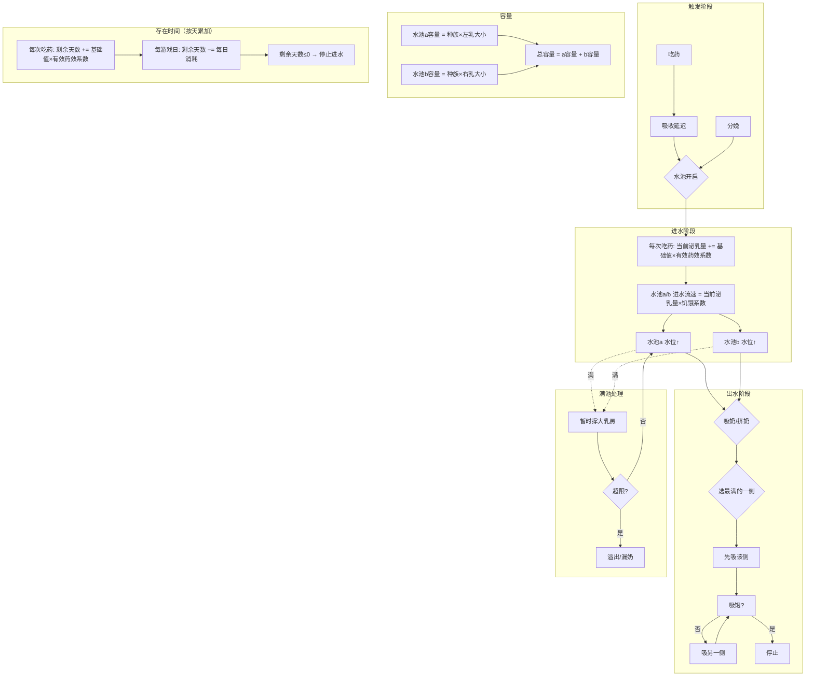
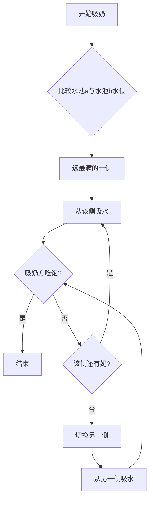

# 泌乳系统 · 水池模型设计规格

**术语**：**Lactating hediff** = RimWorld 中的「泌乳」健康状态（Hediff），挂在 pawn 身上表示当前处于泌乳期；本 mod 使用 `HediffDefOf.Lactating`（或带 Comp 的扩展版），用于驱动产奶、健康/心情等逻辑。规格中「移除 Lactating」即移除该 hediff，泌乳期结束。

**目录**：一 核心公式 · 二 吸奶与挤奶 · 三 其他规则与健康 · 四～六 流程图与数据流 · 七 已定结论 · 八 吃药累加 · 九 待定与实现前约定 · 十 未定义清单（实现前需约定） · 十一 当前代码对照（旧实现） · 十二 审查意见（未考虑/需优化/逻辑）

---

## 当前代码 vs 水池模型 · 对比表

按本规格实现时，将用**水池模型新逻辑替换**下表中「当前代码实现」所述的旧实现（改代码时会删除/重写这些旧逻辑）。下表为唯一对照：实现前可据此排查替换点。

| 项目 | 水池模型设计 | 当前代码实现 | 差异 |
|------|--------------|--------------|------|
| **水池数量/池状态** | 左乳(水池a) + 右乳(水池b)，独立 | `CompEquallyMilkable.fullness`（0~maxFullness），**单池**，无左右分池 | ❌ 当前无左右分池 |
| **总水池开启时间** | 吸收延迟（由身体代谢能力决定） | 无；吃药后立即加 Lactating | ❌ 无吸收延迟 |
| **总水池存在时间** | 剩余天数：按天累加（每次吃药 + 基础值_T×有效药效系数），每游戏日扣减（成瘾满足不扣） | 无单独「剩余天数」；Lactating 的 `SeverityChangePerDay()`：成瘾且满足 → 0，否则 **-0.1×(1+耐受)**；severity 扣到 0 即结束 | ❌ 存在时间算法不同 |
| **进水公式** | **每次吃药**：当前泌乳量 += 基础值×有效药效系数；**每游戏日**：当前泌乳量 −= 每天衰减（= 1/(基础值_T×有效药效系数)），且 ≥0；进水流速 = 当前泌乳量×饥饿系数 | 每 30 tick：`fullness += ...`；**满池时直接 return，不进水** | ❌ 进水逻辑不同 |
| **Lactating severity / 当前泌乳量** | 当前泌乳量为累计值，每次吃药 += 基础值×有效药效系数 | 吃药通过 `IngestionOutcomeDoer_GiveHediff` 加 severity（0.5 或 2）；`TryMergeWith` 时 **Severity += other.Severity** 累加 | ✅ 概念对应（累加） |
| **满池时进水** | 撑大乳房→容量暂增，超限溢出/漏奶 | 满池(`fullness==maxFullness`)时直接不进水 | ❌ 满池停进，无撑大/溢出 |
| **容量** | 水池a/b 容量 = 种族×左/右乳大小；总容量=a+b | MilkAmount = 种族 milkAmount × GetMilkAmountFactorWithTolerance(severity,耐受)；无「乳房大小」、无分侧 | ❌ 无左右容量、无显式乳房大小 |
| **挤奶间隔** | 由 容量/进水 推导 | `MilkIntervalDays()` = 种族 `milkIntervalDays`（如 0.25 天），**固定** | ❌ 间隔固定，非推导 |
| **吸奶顺序/挤奶** | 先吸最满一侧，再吸另一侧，吸饱即停 | 单一 fullness/Charge，GreedyConsume，无「先吸最满一侧」；`SetMilkFullness` 可吸空 | ❌ 无左右选择逻辑；✅ 允许吸空 |
| **吸奶量** | 由吸奶方是否吃饱决定 | `toConsume = Min(toConsumeInTicks, wanted)`，wanted 来自需求 | ✅ 已按需求限制 |
| **进出水同步** | 排水时进水不停 | 满池时停进水，吸奶时若满则之前已停 | ❌ 未做到边排边进 |
| **完全吸空** | 允许 | 允许，SetMilkFullness(0f) | ✅ 一致 |
| **饥饿降流速** | 按饥饿程度降低流速 | BodyResourceGrowthSpeed 参与 GrowthMultiplier，饥饿为 0 则停 | ✅ 有 |
| **成瘾满足** | 永久开着一组阀门；每日消耗系数 0 | `HediffComp_EqualMilkingLactating.SeverityChangePerDay()` 中 addiction.CurStageIndex==0 时 return 0 | ✅ 概念对应 |
| **分娩** | 开一个基础阀 | 需别处添加 Lactating hediff（未在 Comp 内） | ✅ 概念有 |
| **耐受作用** | 有效药效系数 max(1−耐受, 0.05)，参与时间与进水 | `GetProlactinTolerance` = EM_Prolactin_Tolerance.Severity；GetMilkAmountFactorWithTolerance / GetLactatingEfficiencyFactorWithTolerance 用 (1-t) | ✅ 方向一致 |

---

## 一、核心公式

| 项目 | 公式 | 说明 |
|------|------|------|
| **有效药效系数** | **max(1 − 耐受, 0.05)** | 参与存在时间与进水，满耐受时保留至少 5% 效果，符合「耐受=效果变弱而非归零」 |
|  吃药后延迟多久开始总水池开启时间 | 吸收延迟（使用 RimWorld Genes 代谢率：代谢率低起效慢、高起效快）。延迟内不挂 Lactating，开始进水时再给 hediff。 |进水。**已定**：吸收延迟**内不挂 Lactating hediff**，**开始进水时再给予** Lactating hediff（即「水池开启」与 hediff 同步）。
| **剩余天数（按天累加、按游戏时间推进）** | **每次吃药**：剩余天数 += 基础值_T × 有效药效系数；**每游戏日**：剩余天数 −= 每日消耗系数（见下）；剩余天数 ≤ 0 时泌乳结束（停止进水）。**已定**：泌乳结束时**重置状态**（当前泌乳量、水池水位清零，移除 Lactating hediff）；下次吃药或分娩视为新泌乳期。 | 不采用「初始量÷每日衰减量」；直接存天数，按游戏日扣减 |
| **每日消耗系数** | **未成瘾或戒断**：每游戏日 剩余天数 −= **1 + 0.1×(1+耐受)**（即每日扣减的天数，耐受越高扣得越多）；**成瘾且满足**：0（不扣） | 成瘾满足时剩余天数不减少，相当于无限期。与第七节、成瘾表一致。 |
| **当前泌乳量（累计）** | 每次吃药：**当前泌乳量 += 基础值×有效药效系数**（增量 = 基础值×有效药效系数，用当前耐受算）；**每游戏日**：**当前泌乳量 −= 每天衰减**，且 **当前泌乳量 = max(0, 当前泌乳量)**，避免无限累加。 | 产奶强度/进水流速的基数；随吃药累加、随每日衰减回落。 |
| **每天衰减（当前泌乳量）** | **每天衰减 = 1 / (基础值_T × 有效药效系数)**（与存在时间共用同一有效药效系数）；每游戏日扣减一次，扣减后 clamp ≥ 0。 | 耐受高则衰减大，与「剩余天数」逻辑一致；稳态约在 有效药效系数 ≈ 1/√(基础值×基础值_T)。 |
| 水池 a 进水流速 | 当前泌乳量 × 饥饿系数 | 左乳产奶流速；**若只有一侧有乳房，则水池 b 为 0 或不存在** |
| 水池 b 进水流速 | 当前泌乳量 × 饥饿系数 | 右乳产奶流速 |
| **进水受饥饿影响** | **饥饿系数 ∈ [0,1]** | 饥饿越高系数越低，为 0 时停止进水；**机械体使用「能量充足系数」替代饥饿系数** |
| 水池 a 容量 | 种族 × 左乳大小 | 不可变（某时刻），泌乳期会增大乳房→容量变 |
| 水池 b 容量 | 种族 × 右乳大小 | 同上；单侧乳房时 b 为 0 或不存在 |
| 总容量 | 水池 a 容量 + 水池 b 容量 | 两池容量之和；**不设封顶**；进水/存在时间亦不封顶 |

**按本逻辑的变满时间（每侧单独算）：**  
每个乳房单独进水、单独容量。**水池 a 进水流速** = 当前泌乳量×饥饿系数，**水池 b 进水流速** = 当前泌乳量×饥饿系数（规格中左右流速相同，仅容量可左右不同）。  
⇒ **单侧变满时间 = 该侧容量 ÷ (当前泌乳量 × 饥饿系数)**（水池 a：种族×左乳大小 ÷ (当前泌乳量×饥饿系数)；水池 b：种族×右乳大小 ÷ (当前泌乳量×饥饿系数)）。  
左右乳大小若不同，两侧变满时间不同；「两边都满」= 较慢那一侧变满的时间。总容量 = 水池a容量 + 水池b容量 仅表示两池容量之和，不改变「每侧单独算」的结论。

**假设吃一次药（数值例）：**  
设 耐受=0（有效药效系数=1）、饱腹（饥饿系数=1）。吃一次药后 当前泌乳量 = 基础值，**单侧**进水流速 = 基础值，故 **单侧变满时间 = 该侧容量 ÷ 基础值**（游戏日）。  

**已定**：**基础值 = 总容量**；**基础值_T = 3**（游戏日，仅**吃药**时剩余天数增量）；**基础值_T_分娩 = 10**（游戏日，**分娩**时剩余天数增量，与当前代码自然泌乳期一致）。单侧变满时间（恢复时间）= **0.5 游戏日**（约 12 小时）。实现时按此取值即可。  

（若左右乳大小相同，则 单侧容量 = 总容量/2，单侧变满时间 = (总容量/2)÷总容量 = 0.5 游戏日。其他比例参考：基础值 = 2×总容量 → 0.25 天；基础值 = 0.5×总容量 → 1 天。）

**耐受**：**0~1**，越高药效越弱；**初始耐受 = 0**（未吃过药时）。**存在时间与进水**使用 **有效药效系数** = max(1 − 耐受, 0.05)，满耐受时仍保留至少 5% 效果；每日衰减仍用 (1+耐受)。**每次吃药**耐受增加：催乳素（Prolactin）**+0.044**、Lucilactin **+0.176**（体型 1.0 时；体型≠1 时按 divideByBodySize 分摊，由实现定）。**停药后耐受每日自然恢复 -0.015**（纳入规格）。

### 成瘾 / 戒断时的消耗规则（按游戏时间推进）

| 状态 | 每游戏日 剩余天数 扣减 | 说明 |
|------|------------------------|------|
| **未成瘾** | 扣 **1 + 0.1×(1+耐受)** 天 | 自然耗尽；与第一节「每日消耗系数」一致 |
| **成瘾且满足需求** | 0（不扣） | 永久开着一组阀门，剩余天数不减少 |
| **成瘾且戒断中** | 同未成瘾 | 持续扣减直至戒断结束或再次满足 |

（与当前代码一致：成瘾 CurStageIndex=0 为满足，=1 为戒断。）  
**按天累加**：每次吃药时 剩余天数 += 基础值_T × 有效药效系数（可约定第 1 次为 基础值_T，第 2 次起为 基础值_T × 有效药效系数，由实现选定）。

---

## 二、吸奶与挤奶逻辑

1. **吸奶**：先吸**最满的一侧**，再吸**另一侧**，**吸饱就不吸了**（吸奶量由吸奶方饱食度决定）。**两侧水位相同时**（如都空或都满）先吸**容量大**的一侧；容量也相同时**已定**：**男左女右**（男性先左侧、女性先右侧）。
2. **挤奶顺序与吸奶一致**：先挤最满的一侧，再挤另一侧；两侧水位相同时先挤容量大的一侧；容量也相同时同样男左女右。

---

## 三、其他规则

- **按天累加、按游戏时间推进**：存在时间用**剩余天数**表示。每次吃药 剩余天数 += 基础值_T × 有效药效系数；每游戏日 剩余天数 扣减「每日消耗系数」。**当前泌乳量**：**每次吃药 当前泌乳量 += 基础值×有效药效系数**；**每游戏日 当前泌乳量 −= 每天衰减**（每天衰减 = 1/(基础值_T×有效药效系数)），且 **当前泌乳量 = max(0, 当前泌乳量)**。可持续天数 = 当前剩余天数。
- **进水受饥饿影响**：进水流速 × 饥饿系数；饥饿程度越高系数越低，为 0 时停止进水；**机械体使用能量充足系数**。
- **成瘾满足**：永久开着一组阀门（每游戏日不扣剩余天数）；**戒断中**：与未成瘾相同，每游戏日扣减剩余天数。
- 满池进水：暂时撑大乳房（像气球），超限**溢出/漏奶**；**溢出或漏奶时生成地面污物，不扣除水池已有水位**（即水池量不变，仅产生污物）。
- 允许完全吸空
- 进出水同步进行
- 不允许多个同时吸奶
- 分娩：**进入泌乳期**，开一个基础阀。**已定**：**剩余天数 += 10** 游戏日（**基础值_T_分娩 = 10**，自然泌乳期，与当前代码一致）；**当前泌乳量 += 基础值**（总容量）。二者均**不乘有效药效系数**。**若当前已在药物泌乳期，分娩与药物泌乳叠加**（剩余天数在现有基础上 +10，当前泌乳量在现有基础上 +基础值，不覆盖）。
- 多乳：左右独立水池；**单侧乳房时水池 b 容量/进水为 0 或不存在**
- **催乳剂 Galactogogues**：仅在**已有泌乳时**使用的补充剂，暂时提高乳腺活性，约 3 天内产奶量增加；水池模型里体现为**临时提高进水基础值或额外阀门**（具体倍率/时长按实现）。*当前代码*：物品 `Cumpilation_Galactogogues`，服用后给予 Hediff `Cumpilation_ActiveMammaries`（severity 1.0，每日 −0.33，约 3 天消退），该 hediff 通过 `HediffCompProperties_FluidAmountChange` 对乳房产奶量乘数 1.4（multiplier），即临时提高产奶量约 40%。
- **基因（永久泌乳、奶类型等）**：体现为「默认开 N 个阀」或「基础值/容量倍率」。

### 健康影响（纳入规格）

- **饥饿率**：泌乳且未满池时，按当前泌乳/进水状态增加饥饿率（更易饿）；满池时不额外增加。机械体用同逻辑增加能量消耗。
- **意识/操纵/移动**：仅**药物诱发泌乳**（有耐受或成瘾）时，可给予 Consciousness、Manipulation、Moving 增益（具体倍率/开关由实现定）；分娩等非药物泌乳无此增益。
- **生育率**：泌乳期可设生育率修正（如 0.05），与产奶逻辑独立，由实现定。
- **其它健康影响（如乳腺炎、堵塞等）**：泌乳期可扩展其它健康状态（如乳腺炎、堵塞等）；具体由实现或后续扩展定。
- **产奶量/效率**：由水池「进水流速」「容量」及当前泌乳量×饥饿系数决定，不在此单独列项。

### 心情/记忆（纳入规格）

- **强制挤奶**：挤奶者不在产主的「允许吸奶」名单内时，产主（被挤奶者）获得**负面记忆**（如 `EM_ForcedMilking`）。实现时按此条件触发。
- **伴侣食用产主的奶/精液制品**：食用者为产主伴侣（Lover）时，产主获得**正面记忆**（如 `EM_PartnerAteMyProduct`）。
- **性行为中泌乳**：若设置开启，性行为中 initiator/partner 若为泌乳者则获得记忆（如 `EM_HadSexWhileLactating`）。具体开关由实现定。
- **催乳素相关心情（愉悦/戒断/高量等）**：可定义催乳素愉悦、戒断、高量等记忆（如 `EM_Prolactin_Joy`、`EM_Prolactin_Withdrawal`、`EM_Prolactin_HighThought`）；触发时机可由实现或后续扩展约定（当前代码中仅 Def 引用、未见触发给记忆）。
- **挤奶/吸奶/吃药/戒断对心情的进一步细分**：可区分「被允许的人挤奶」正面、「成瘾满足」正面等；具体是否实现及效果由实现定。
- **满池/空池、长时间未挤奶等对心情或健康的差异化影响**：可对满池、空池、长时间未挤奶等状态给予不同心情或健康影响；具体由实现定。

### 满池撑大与排水后回缩

- **基础容量**：种族×乳房大小（未撑大时的容量）。**撑大**：满池继续进水时暂时允许超过基础容量；排水后超出部分缓慢回缩。
- **恢复时间**：排水后回缩到基础容量 = **0.5 游戏日**（见第七节已定）。
- **回缩公式（建议）**：每游戏日 `当前容量 = 基础容量 + (当前容量 - 基础容量) × (1 - 回缩率)`，回缩率 0.5～1。长期满池可不回缩或极慢回缩，由实现定。

*参考（旧实现）*：当前代码变满约 0.25～1 游戏日（G=GrowthMultiplier）；水池模型下单侧变满 = 该侧容量÷(当前泌乳量×饥饿系数)，基础值=总容量时 0.5 游戏日。

## 四、流程图



---

## 五、吸奶顺序详细流程图



---

## 六、数据流总览

```mermaid
flowchart LR
    subgraph 输入
        X1[当前泌乳量/剩余天数]
        X2[耐受]
        X3[种族]
        X4[乳房大小]
    end

    subgraph 计算
        Y0[有效药效系数 = max(1-耐受, 0.05)]
        Y1[每次吃药: 当前泌乳量 += 基础值×有效药效系数]
        Y2[剩余天数: 按天累加, 每游戏日扣减]
        Y3[容量 = 种族×乳房大小]
    end

    subgraph 输出
        Z1[水池a水位]
        Z2[水池b水位]
    end

    X1 --> Y1
    X1 --> Y2
    X2 --> Y0
    Y0 --> Y1
    Y0 --> Y2
    X3 --> Y3
    X4 --> Y3
    Y1 --> Z1
    Y1 --> Z2
```

---

## 七、审阅建议与已定结论

以下为实现时已定结论（审阅后确定）。

| 条 | 建议 / 已定 | 说明 |
|----|-------------|------|
| **存在时间与衰减** | **已定**：采用**按天累加、按游戏时间推进**。存在时间 = **剩余天数**；每次吃药 剩余天数 += 基础值_T × 有效药效系数；每游戏日 剩余天数 −= **每日消耗系数**（未成瘾/戒断时为 **1 + 0.1×(1+耐受)**，成瘾满足时为 0）。可持续天数 = 当前剩余天数，不再使用「初始量÷每日衰减量」。 | 按游戏时间直接推进。与第一节一致。 |
| **耐受 = 1 时** | **已定**：采用 **有效药效系数** = max(1−耐受, 0.05)，存在时间与进水均用该系数，满耐受时保留至少 5% 效果。见第一节。 | 不再断崖到 0。 |
| **吃药次数** | **已定**：**实现上不必单独维护「吃药次数」**。**当前泌乳量**为累计值：每次吃药 **当前泌乳量 += 基础值×有效药效系数**（增量 = 基础值×有效药效系数，用当前耐受算）；同时 剩余天数 += 基础值_T×有效药效系数。进入新泌乳期时重置当前泌乳量与剩余天数。若需显示「本周期吃了多少次」可另行统计。 | 简化逻辑见第八节。 |
| **左右池进水** | **已定**：只影响容量、不影响流速。两侧产奶流速相同，容量由左右乳大小决定。 | 保持公式不变。 |
| **满池撑大容量** | **建议**：排水后**缓慢回缩**到基础容量。**恢复时间（回缩到基础容量）= 0.5 游戏日**（约 12 小时）；每游戏日将超出部分按比例减少，由实现达到该时间量级。长期持续满池可不回缩或极慢回缩，由实现定。 | 避免永久变大未定义。 |
| **成瘾后存在时间** | **已定**：成瘾且满足时**不衰减**，存在时间视为无限。不检查存在时间上限。 | 与「永久阀门」一致。 |
| **泌乳结束重置** | **已定**：剩余天数≤0 时停止进水，并**重置状态**（当前泌乳量、水池水位清零，移除 Lactating hediff）；下次吃药或分娩视为新泌乳期。 | 与第一节、第九节一致。 |
| **基础值_T** | **已定**：**基础值_T = 3**（游戏日），仅**吃药**时：剩余天数 += 3 × 有效药效系数。**基础值_T_分娩 = 10**（游戏日），**分娩**时：剩余天数 += 10（不乘有效药效系数）。 | 与第一节、第八节一致。 |

---

## 八、吃药次数与效果累加（简化逻辑）

**当前泌乳量**是**累计值**。每次吃药时：
- **当前泌乳量 += 基础值×有效药效系数**（本次增量 = 基础值×有效药效系数，用**当前**耐受算）；
- **耐受**增加：吃 **EM_Prolactin** 时 +0.044、吃 **EM_Lucilactin** 时 +0.176（体型 1.0 时；体型≠1 时按 divideByBodySize 分摊，与当前代码一致）；
- 剩余天数 += 基础值_T × 有效药效系数。

**进水流速** = 当前泌乳量 × 饥饿系数。  
**每游戏日**：剩余天数扣减每日消耗系数；耐受若停药则每日恢复 -0.015。  
**吃药次数**不必单独维护；若需显示「本泌乳期吃了多少次」可另行统计。

---

## 九、待定 / 实现前约定

| 类别 | 内容 |
|------|------|
| **吸收延迟** | **已定**：使用 RimWorld **Genes 代谢率**；代谢率低起效慢、高起效快。具体换算（代谢→延迟天数或 tick）由实现定。延迟内不挂 Lactating hediff，开始进水时再给予 hediff。 |
| **满池撑大与溢出** | 恢复时间 0.5 游戏日（见第七节）。**溢出/漏奶**：生成地面污物，**不扣除水池已有水位**。 |
| **吸奶/挤奶耗时** | 吸奶时间与挤奶时间与容量/流速的关系未量化。 |
| **动物/非人类种族** | 种族×乳房大小、成年雌性动物「始终泌乳」开关等未展开；**机械体**是否参与挤奶/吸奶、仅产奶与能量消耗等未统一；**超过两乳**（如四乳）水池数量与分配未约定。 |
| **基础值_T 与 基础值_V** | **进水**用「基础值」：每次吃药 当前泌乳量 += 基础值×有效药效系数，进水流速 = 当前泌乳量×饥饿系数。**存在时间**：**吃药**时 剩余天数 += 基础值_T×有效药效系数；**分娩**时 剩余天数 += **基础值_T_分娩**（= 10 游戏日）。**已定**：**基础值_T = 3**（游戏日）；**基础值_T_分娩 = 10**（游戏日，与当前代码自然泌乳期一致）。基础值 = 总容量（已定）；由实现按上执行。**当前代码对应数值**见下「当前代码：基础值_T 与 基础值」。 |
| **泌乳结束与重置** | **已定**：剩余天数≤0 时停止进水并**重置状态**（当前泌乳量、水池水位清零，移除 Lactating hediff）；成瘾长期满足时当前泌乳量是否封顶未写。 |
| **UI/显示** | 双池水位、剩余天数、当前泌乳量是否对玩家可见、如何展示（如 hediff 悬停、信息面板、表格列等）由实现定。 |
| **心情/记忆与健康** | 心情/记忆见第三节「心情/记忆」，健康影响见第三节「健康影响」；其余细分（见下）待定或由实现定。 |

---

## 十、未定义清单（实现前需约定）

以下为规格中**尚未完全定义**、需在实现前或实现中约定的项，按类别整理便于逐条拍板。

### 10.1 时间与数值

| 项 | 说明 | 约定/建议 |
|----|------|----------|
| **吸收延迟** | 由身体代谢能力决定，**代谢 → 延迟天数/tick** 的换算公式未定。 | **已定**：使用 RimWorld **Genes 代谢率**（Metabolic efficiency）；代谢率低起效慢、高起效快。延迟内不挂 Lactating，开始进水时再给 hediff。 |
| **吸奶/挤奶耗时** | 吸奶时间、挤奶时间与容量/流速的关系**未量化**。 | **已定**：先**沿用当前代码的固定时长**。后续是否按容量/流速量化列入**待办**。 |
| **满池回缩公式** | 回缩率与「0.5 游戏日回缩到基础容量」的对应关系；按**身体健康度**回缩。 | **已定**：按**身体健康度**进行回缩。**建议**：每游戏日回缩量 = (当前容量 − 基础容量) × 回缩率 × 身体健康度系数；身体健康度越高回缩越快（身体好恢复快），约 0.5 游戏日回缩到基础容量时取回缩率与健康系数乘积在 0.5～1 量级。实现时可用 `pawn.health.summaryHealth.SummaryHealthPercent` 或等价健康度。 |
| **第 1 次吃药是否乘有效药效系数** | 剩余天数/当前泌乳量：第 1 次与第 N 次是否一致。 | **已定**：规格统一为**每次均 × 有效药效系数**（含第 1 次）。 |

### 10.2 选侧与顺序

| 项 | 说明 | 约定/建议 |
|----|------|----------|
| **两侧水位相同时选哪侧** | 吸奶/挤奶时两侧都空或都满、且容量也相同时，先吸/挤哪一侧。 | **已定**：**男左女右**（男性 pawn 先左侧、女性 pawn 先右侧）。 |

### 10.3 种族、机械体、多乳

| 项 | 说明 | 约定/建议 |
|----|------|----------|
| **动物/非人类种族** | 种族×乳房大小、成年雌性动物「始终泌乳」等**未展开**。 | **已定**：先**沿用当前代码**的 GetDefaultMilkProduct、isMilkable、femaleAnimalAdultAlwaysLactating 等。后续细化列入**待办**。 |
| **机械体** | 是否参与挤奶/吸奶、仅产奶与能量消耗等。 | **已定**：**先不做**。是否实现列入**待办**，由作者考虑后决定。 |
| **超过两乳（如四乳）** | 水池数量、容量与进水分配**未约定**。 | **已定**：**N 乳 = N 个池**，容量按部位分配。 |

### 10.4 分娩、催乳剂、溢出

| 项 | 说明 | 约定/建议 |
|----|------|----------|
| **分娩具体数值** | 分娩 = 自然生育触发的泌乳；**游戏/RJW 中的实现与时间**。 | **已定**：分娩 = **自然泌乳**。**剩余天数 += 10** 游戏日（**基础值_T_分娩 = 10**，与当前代码自然泌乳期一致，和药物 基础值_T=3 区分）；**当前泌乳量 += 基础值**（总容量）。二者均**不乘**有效药效系数。**当前实现**：RJW 分娩时在 `Hediff_BasePregnancy.PostBirth` 中仅 `mother.health.AddHediff(xxx.Lactating, Chest, null)`，Lactating 初始 severity 0.9999、每日 −0.1，约 10 游戏日后结束；规格采用 基础值_T_分娩=10 以沿用该体感。 |
| **催乳剂与累加** | 催乳剂与当前泌乳量累加的关系、结束时是否回退。 | **已定**：**临时倍率**（如 ×1.4）；结束时**只撤倍率、不扣当前泌乳量**。持续时长沿用当前代码约 3 天。 |
| **溢出/漏奶产物** | 满池溢出或漏奶是否生成地面污物、是否扣水池、触发频率。 | **已定**：不扣水池水位、**生成地面污物**；是否计入统计、触发频率由实现定。 |

### 10.5 状态与边界

| 项 | 说明 | 约定/建议 |
|----|------|----------|
| **吸收延迟期间状态** | 吸收延迟内是否算「泌乳期」、是否挂 Lactating、健康/心情是否生效。 | **已定**：延迟内**不挂** Lactating，开始进水时再给；不算泌乳期、健康/心情不生效（与规格一致）。 |
| **成瘾长期满足时当前泌乳量是否封顶** | 成瘾满足时当前泌乳量是否设上限。 | **已定**：**不封顶**（无限累加）。 |
| **药物诱发判定** | 意识/操纵/移动增益仅对「药物诱发泌乳」生效：如何判定。 | **已定**：**区分来源**。需在实现中区分本次泌乳来自吃药还是分娩/自然，仅药物诱发时给予意识/操纵/移动增益。 |

### 10.6 体型与耐受

| 项 | 说明 | 约定/建议 |
|----|------|----------|
| **体型≠1 时耐受增量分摊** | 耐受 +0.044 / +0.176 在体型≠1 时按 divideByBodySize 分摊。 | **已定**：**与当前代码一致**（divideByBodySize=true 已写在 Def）。 |

### 10.7 UI、心情与健康细分

| 项 | 说明 | 约定/建议 |
|----|------|----------|
| **UI/显示** | 双池水位、剩余天数、当前泌乳量是否对玩家可见、如何展示。 | **已定**：**对玩家可见**，在 **hediff 悬停** 中展示。 |
| **意识/操纵/移动增益** | 药物诱发泌乳时的具体倍率/开关。 | 可沿用当前代码的 lactatingGainCapModPercent、lactatingGainEnabled。 |
| **生育率修正** | 泌乳期生育率修正（如 0.05）。 | **已定**：与产奶逻辑独立，**沿用 vanilla 或配置**即可。 |
| **性行为中泌乳记忆** | 是否给记忆、开关。 | **已定**：**沿用当前代码的开关或配置**。 |
| **催乳素愉悦/戒断/高量记忆** | 触发时机。 | **已定**：实现时**按需求加触发条件**。列入**待办**。 |
| **挤奶/吸奶/吃药/戒断心情细分** | 「被允许的人挤奶」正面、「成瘾满足」正面等。 | **已定**：**由实现定**。列入**待办**。 |
| **满池/空池、长时间未挤奶对心情或健康** | 差异化影响。 | **已定**：**由实现定**。列入**待办**。 |
| **其它健康影响（乳腺炎、堵塞等）** | 扩展健康状态。 | **已定**：**由实现定**。列入**待办**。 |

### 10.8 待办清单（实现/后续扩展）

以下为已约定「先沿用 / 先不做 / 由实现定」或需后续细化的项，实现时可按此清单逐项处理或排期。

| # | 待办项 | 说明 |
|---|--------|------|
| 1 | **吸奶/挤奶耗时** | 先沿用当前代码固定时长；后续可考虑按容量/流速量化。 |
| 2 | **动物/非人类种族** | 先沿用 GetDefaultMilkProduct、isMilkable、femaleAnimalAdultAlwaysLactating 等；后续可细化规格。 |
| 3 | **机械体** | 先不做；是否实现挤奶/吸奶与能量消耗待作者决定。 |
| 4 | **催乳素愉悦/戒断/高量记忆** | 按需求加触发条件（当前代码仅 Def 引用）。 |
| 5 | **挤奶/吸奶/吃药/戒断心情细分** | 由实现定（如「被允许的人挤奶」正面、「成瘾满足」正面等）。 |
| 6 | **满池/空池、长时间未挤奶对心情或健康** | 由实现定。 |
| 7 | **其它健康影响（乳腺炎、堵塞等）** | 由实现定。 |

---

## 十一、当前代码对照（旧实现）

### 当前代码已实现的心情、健康影响（规格已纳入，下表为对照）

**规格已纳入**：心情/记忆见第三节「心情/记忆」，健康影响见第三节「健康影响」。下表为当前代码实现与代码位置对照，实现时可按表替换或保留。

**心情 / 记忆（Thought / Memory）**

| 触发 | 效果 | 代码位置 |
|------|------|----------|
| **强制挤奶** | 产主（被挤奶者）获得**负面记忆** `EM_ForcedMilking`。条件：挤奶者不在产主的「允许吸奶」名单内。 | `CompEquallyMilkable.Gathered()` |
| **伴侣食用产主的奶/精液制品** | 产主获得**正面记忆** `EM_PartnerAteMyProduct`。条件：食用者为产主伴侣（Lover）。 | `MilkProductConsumptionPatch.Patch_PostIngested_PartnerAteMyProduct` |
| **性行为中泌乳** | 若设置开启，initiator/partner 泌乳者获得记忆 `EM_HadSexWhileLactating`。 | `RJWSexAndFertility` |
| 催乳素愉悦/戒断/高量等 | `EMDefOf` 中定义 `EM_Prolactin_Joy`、`EM_Prolactin_Withdrawal`、`EM_Prolactin_HighThought`；**代码中未见触发给记忆**，可能由 XML 或后续扩展使用。 | 仅 Def 引用 |

**健康 / Hediff 阶段（旧实现，按本规格将由水池逻辑替换）**

按本规格实现时，下述旧实现将用**水池模型新逻辑替换**（改代码时会删除/重写这些旧逻辑）；下表仅作对照参考。**规格已纳入**：饥饿率、意识/操纵/移动、生育率 见第三节「健康影响」，实现时按该节执行即可。

| 项目 | 实现 | 说明 |
|------|------|------|
| **饥饿率** | Lactating 的 `CurStage.hungerRateFactorOffset` = mult^severity（未满池时），满池时为 0；机械体用同值作 `MechEnergyUsageFactor` offset。 | 泌乳且未满池时更易饿，满池不额外加饥饿。规格见第三节「健康影响」。 |
| **意识/操纵/移动** | 仅**药物诱发泌乳**（有耐受或成瘾）时，阶段增加 `PawnCapacityModifier`（Consciousness、Manipulation、Moving），增益 = lactatingGainCapModPercent×severity，受 lactatingGainEnabled 控制。 | 分娩等非药物泌乳无此增益。规格见第三节「健康影响」。 |
| **生育率** | Lactating 的 vanilla 阶段 `fertilityFactor = 0.05`。 | 与产奶逻辑独立。规格见第三节「健康影响」。 |

以上「挤奶/吸奶/吃药/戒断心情细分」「其它健康影响（乳腺炎、堵塞等）」「满池/空池、长时间未挤奶对心情或健康的影响」已纳入第三节（心情/记忆、健康影响）；当前代码未实现，实现或后续扩展时可按第三节约定添加。

### 当前代码：动物/非人类种族

- **种族与奶量**：`GetDefaultMilkProduct(def)` 按种族区分。**Humanlike**：milkAmount = 3×（体型/人类体型），milkIntervalDays = 0.25，isMilkable = true。**非 Humanlike（动物）**：默认 isMilkable = false，milkAmount = 14×（体型/牛体型），milkIntervalDays = 1；可在设置中为种族开启 isMilkable。
- **成年雌性动物始终泌乳**：选项 `femaleAnimalAdultAlwaysLactating` 为 true 时，殖民地内成年雌性动物会 `GetOrAddHediff(Lactating)` 且 severity ≥ 1，即视为始终泌乳（`CompEquallyMilkable.Active` 中判定）。
- **非人形且不可挤奶**：若种族非 Humanlike 且 `!IsMilkable()`，会移除其 Lactating hediff，不产奶。
- **多乳扩展**：当前代码无超过两乳的分配逻辑；规格将多乳扩展列入待定。

### 当前代码：催乳剂（Galactogogues）

- **物品**：`Cumpilation_Galactogogues`（催乳剂），描述为「暂时提高乳腺活性，产奶量增加约 3 天」。
- **效果**：服用后 `IngestionOutcomeDoer_GiveHediff` 给予 `Cumpilation_ActiveMammaries`（乳腺兴奋），severity 1.0；该 hediff 每日 severity −0.33，约 3 天消退。
- **产奶加成**：`Cumpilation_ActiveMammaries` 带 `HediffCompProperties_FluidAmountChange`，targetBreast=true，multiplier=1.4，即产奶量临时 ×1.4（需已有泌乳才生效）。水池模型对应「临时提高进水基础值或阀门」。

### 当前代码：基础值_T 与 基础值（对应数值）

当前代码**没有**名为「基础值」或「基础值_T」的变量；水池模型中的两个概念对应关系如下。

- **基础值（对应「当前泌乳量」每次吃药增量）**  
  当前实现为：每次吃药通过 `IngestionOutcomeDoer_GiveHediff` 给 Lactating 增加的 **severity**（会与已有 severity 累加）。  
  - **EM_Prolactin**：`Lactating` **severity += 0.5**（`Defs/LactatingItems.xml`）。  
  - **EM_Lucilactin**：`Lactating` **severity += 2**（同文件，描述为 0.5×4）。  
  规格中的「基础值×有效药效系数」在当前代码里对应「本次给的 severity」（Prolactin 0.5、Lucilactin 2；高耐受时由 toleranceChemical 等逻辑削弱，无单独 0.05 下限的显式数值）。

- **基础值_T（对应「剩余天数」每次吃药增量）**  
  当前代码**没有「剩余天数」**，只有 Lactating 的 severity 每日衰减：`SeverityChangePerDay() = -0.1×(1+耐受)`（成瘾且满足时为 0）。  
  规格**已定**：**基础值_T = 3**（游戏日），吃药时 剩余天数 += 3 × 有效药效系数。**基础值_T_分娩 = 10**（游戏日），分娩时 剩余天数 += 10（与当前代码自然泌乳约 10 天一致）。

### DrugEffectSystemFix 与规格 基础值/基础值_T 的对应关系

`EqualMilking.cs` 中的 **DrugEffectSystemFix** 定义了一组常量与「递减累加」公式，但**当前未被任何逻辑调用**（仅定义、未接入泌乳/产奶流程）。与规格的对应关系如下，实现水池模型时可选择沿用、替换或删除该段代码。

| 规格概念 | DrugEffectSystemFix 常量/用法 | 数值 | 说明 |
|----------|------------------------------|------|------|
| **每日消耗系数**中的「0.1×(1+耐受)」 | **DAILY_DECAY** | 0.1f | 注释「每日自然衰退0.1」；与 `HediffComp_EqualMilkingLactating.SeverityChangePerDay()` 中写死的 -0.1 一致。规格：每游戏日 剩余天数 −= 1 + 0.1×(1+耐受)。 |
| 产奶/进水的**基础倍率**（1 倍） | **BASE_PRODUCTION_MULTIPLIER** | 1.0f | 用作「基础产奶倍率」、衰减下限；规格中「基础值 = 总容量」时进水流速的系数 1 可与此对应。 |
| 每次吃药的**额外加成**（递减累加） | **INITIAL_BONUS** | 0.3f | 注释「初始加成0.3」；`CalculateCumulativeProduction` 中按用药次数累加 0.3、0.27、0.243…（×DECAY_FACTOR^i）。规格无此「每次递减 10% 的累加」模型，若不做递减累加可忽略。 |
| 每次加成的**递减率** | **DECAY_FACTOR** | 0.9f | 注释「每次递减10%」；仅用于上述累加公式。规格：当前泌乳量线性累加「基础值×有效药效系数」，无逐次递减。 |
| 耐受对效果的**削弱** | **TOLERANCE_DECAY** | 0.9f | `CalculateCumulativeProduction` 中 (0.9^(usageCount-1))。规格：有效药效系数 max(1−耐受, 0.05)，算法不同。 |
| 自然衰减率（约 15 天消退） | **NATURAL_DECAY_RATE** | 0.067f | 用于 `ApplyExponentialDecay` / `CalculateDecayedEffect`。规格用「剩余天数」按天扣减，不用指数衰减率。 |
| 耐受对衰减的**加成** | **TOLERANCE_DECAY_BOOST** | 0.033f | 与 NATURAL_DECAY_RATE 一起组成「综合衰减率」。规格：每日消耗 = 1 + 0.1×(1+耐受)，含义不同。 |

- **规格 基础值**：对应**实际生效**的数值 = XML 中每次吃药给的 Lactating **severity**（0.5 / 2）。DrugEffectSystemFix 的 BASE_PRODUCTION_MULTIPLIER、INITIAL_BONUS 未参与该流程。
- **规格 基础值_T**：**已定**：**基础值_T = 3**（游戏日）。当前代码无「剩余天数」，实现水池模型时每次吃药 剩余天数 += 3 × 有效药效系数即可。
- **结论**：实现水池模型时，若采用「剩余天数 + 当前泌乳量线性累加」，可直接用规格公式，不必依赖 DrugEffectSystemFix；若希望保留或复用「递减累加」思路，需在规格中单独约定并接入该套常量与公式。

---

**小结**：当前代码用 **单池 fullness + Lactating severity 累加与每日衰减** 实现泌乳；与水池模型的主要差异为：无左右双池、无剩余天数（用 severity 衰减代替）、无吸收延迟、满池停进（无撑大/溢出）、挤奶间隔固定、无「先吸最满一侧」。

---

## 十二、审查意见（未考虑 / 需优化 / 逻辑）

以下为对规格的集中审查，便于查漏与实现前约定。

### 1. 可能未考虑到的

| 类别 | 内容 | 建议 |
|------|------|------|
| **泌乳结束与重置** | 剩余天数≤0 时停止进水后，当前泌乳量、水池水位、Lactating hediff 是否清零/移除；下次吃药或分娩是否视为全新泌乳期。 | 已在第一节、第九节补充「由实现定」及建议：结束即重置并移除 hediff。 |
| **分娩与药物泌乳叠加** | 若已在药物泌乳期时分娩，剩余天数/当前泌乳量是叠加、覆盖还是独立两段。 | 第三节已写「由实现定」。 |
| **吸收延迟期间状态** | 吸收延迟内是否已算「泌乳期」、是否挂 Lactating、健康/心情是否生效。 | 待定；建议约定：延迟内可无 hediff，开始进水时再给，或由实现定。 |
| **两侧水位相同** | 吸奶/挤奶时两侧水位相同（都空或都满）先选哪侧。 | 第二节已约定「由实现定（如左侧优先或随机）」。 |
| **机械体完整规则** | 机械体是否有水池/挤奶/吸奶，还是仅产奶与能量消耗；能量充足系数与「水池」关系。 | 多处提能量充足系数与能量消耗，是否可被挤奶/吸奶未统一写清，可放在「动物/非人类种族」待定中。 |
| **超过两乳** | 四乳等种族：水池数量、容量与进水分配。 | 仅约定单侧时 b 为 0；多乳扩展可列入待定。 |
| **催乳剂与累加** | 催乳剂「临时提高进水基础值」与当前泌乳量累加的关系、结束时是否回退。 | 第三节仅概念；实现时需约定是否加临时倍率或临时基础值、持续时长。 |
| **溢出/漏奶产物** | 满池溢出或漏奶是否生成地面物品、是否扣减水池水位、触发频率。 | 第九节待定已列「溢出/漏奶是否生成地面污物、是否计入统计未写」。 |
| **基础值_T 与 基础值** | 两者是否同值、单位关系、第 1 次吃药是否乘有效药效系数。 | 第九节已补充建议；第一次 vs 第 N 次可由实现选定。 |
| **药物诱发判定** | 「仅药物诱发泌乳给意识/操纵/移动增益」：判定为「有 Lactating 且（有耐受或成瘾）」即可，还是需区分「本次泌乳来源」。 | 当前表述可理解为有耐受或成瘾即视为药物诱发；若需严格「仅吃药触发的本次泌乳」需在实现中约定。 |
| **UI/显示** | 双池水位、剩余天数、当前泌乳量是否对玩家可见、如何展示。 | 可选；实现时再定。 |

### 2. 建议优化的

| 类别 | 内容 | 处理 |
|------|------|------|
| **每日消耗系数统一** | 原第一节「1+耐受」与成瘾表「1+等效 0.1×(1+耐受)」表述不一致。 | 已统一为 **1 + 0.1×(1+耐受)**（每游戏日扣减天数），第一节、成瘾表、第七节一致。 |
| **基础值_T 与基础值** | 多处出现，未集中定义单位与关系。 | 第九节已补充「进水用基础值、存在时间用基础值_T」及是否同值/成比例由实现定。 |
| **满池回缩与 0.5 天** | 回缩率 0.5～1 与「0.5 游戏日回缩到基础容量」的对应关系未给出公式。 | 保持「恢复时间=0.5 游戏日」已定；实现时由回缩率反推或给定一组推荐值。 |
| **流程图与状态** | 第四节图「剩余天数≤0 → 停止进水」未体现水池/hediff 是否重置。 | 正文已补充「泌乳结束」建议；图可保持简洁，细节以正文为准。 |
| **挤奶与吸奶** | 第五节图为吸奶顺序；挤奶仅文字说「顺序与吸奶一致」。 | 已足够；实现时挤奶按同一选侧逻辑即可。 |

### 3. 逻辑不通或已修正的

| 问题 | 原状 | 修正 |
|------|------|------|
| **每日消耗系数** | 第一节写「1+耐受」、第七节写「1+等效 0.1×(1+耐受)」，量纲与数值不一致。 | 统一为 **每游戏日 剩余天数 −= 1 + 0.1×(1+耐受)**，三处一致。 |
| **分娩是否乘有效药效系数** | 未写分娩增加剩余天数/当前泌乳量时是否乘有效药效系数。 | 第三节已明确：分娩**不乘**有效药效系数，视为自然泌乳。 |
| **泌乳结束后的状态** | 仅写「剩余天数≤0 时泌乳结束」，未说是否重置状态。 | 第一节表格与第九节已补充：是否重置、移除 hediff 由实现定，并给建议。 |
| **两侧同水位选侧** | 未定义「最满一侧」相同时的行为。 | 第二节已约定由实现定（如左侧优先或随机）。 |

