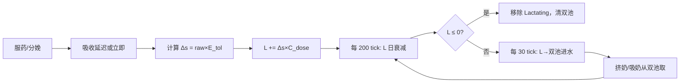
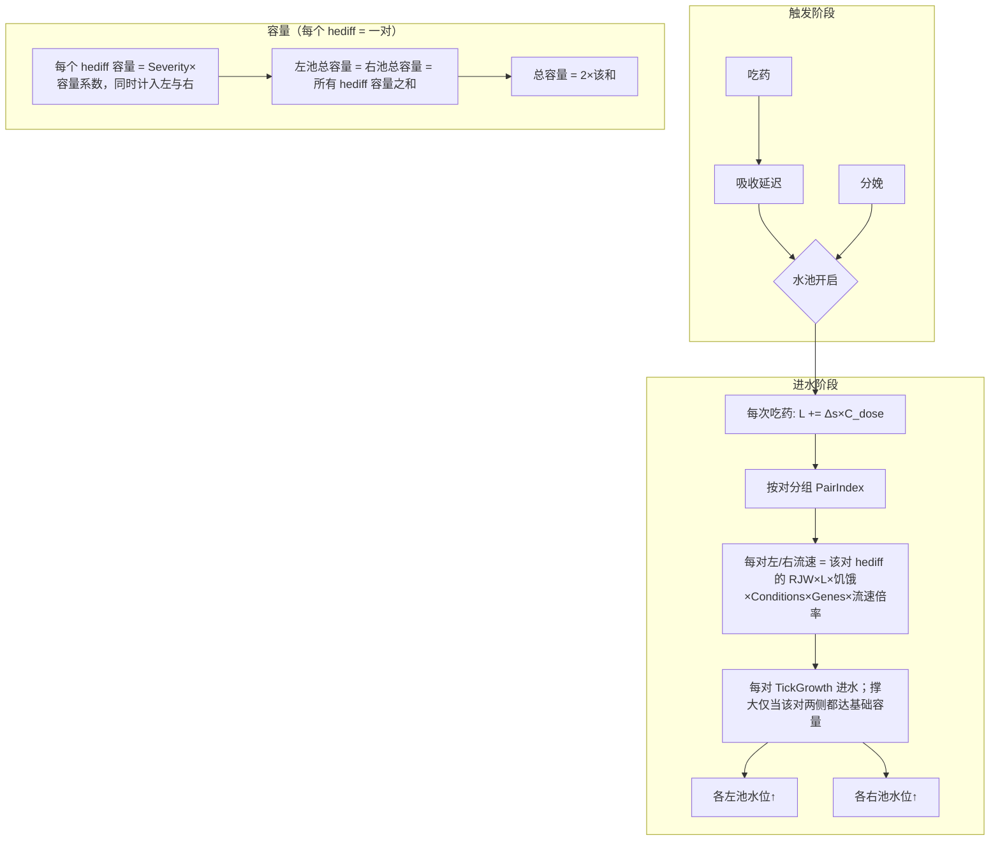
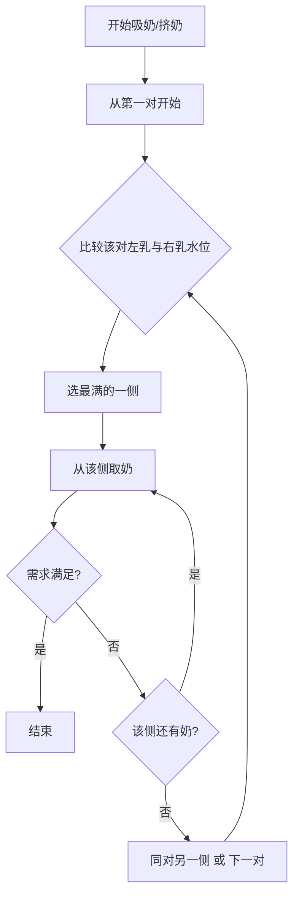
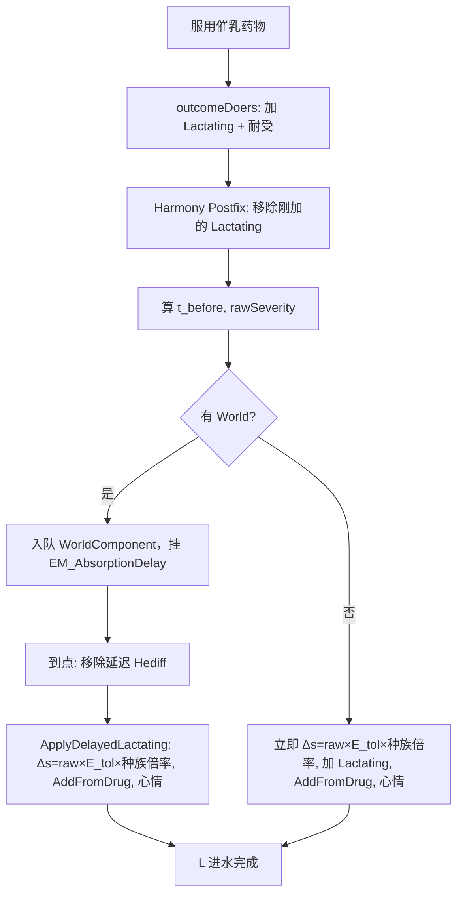

# 泌乳系统逻辑图

本文档以**逻辑图与数据流**形式描述 rjw-cummilk 泌乳系统：从服药/分娩到水池 L、双池、挤奶/吸奶直至泌乳结束。

---

## 一、符号与概念

| 符号/概念 | 含义 |
|-----------|------|
| **L** | 当前泌乳量（唯一状态量），L ≤ 0 时泌乳结束 |
| **E_tol(t)** | 统一耐受系数 = max(1 − 耐受 t, 0.05)。实现可选用指数：E_tol = [max(1−t, 0.05)]^exponent（toleranceFlowImpactExponent）；设置 allowToleranceAffectMilk 关闭时恒为 1。 |
| **D(L, E)** | 每日衰减 = 1/(B_T×E) + k×L；**B_T 由设置 baselineMilkDurationDays 反推**（GetEffectiveBaseValueTForDecay），单次剂量时剩余天数≈基准天数；k=0.01 |
| **双池** | 左乳/右乳多对独立池，总满度=所有乳池之和。**结构**：GetBreastPoolEntries 按「每个 hediff = 一对乳房」生成条目：每个 RJW 乳房 hediff 产生 key_L、key_R 两条，同一对共享 PairIndex。**容量**：每个 hediff 的容量 = 该 hediff Severity×容量系数，**同时计入左池与右池**；左池总容量 = 右池总容量 = 所有 hediff 容量之和，总容量 = 2×该和。**流速**：每个 hediff 的 fluidMultiplier **同时计入左、右**；左/右池流速倍率 = 所有 hediff 的 fluidMultiplier 之和；每对条目的 FlowMultiplier 取该 hediff 的完整倍率。**进水**：每 30 tick 按对分组，每对用 LactationPoolState.TickGrowth 进水；**撑大按对**：仅当该对两侧都达基础容量后，该对才允许向 1.2× 撑大。**挤奶/吸奶**：与吸奶共用 DrainForConsume，从第一对开始按对、每对选较满一侧（相同时男左女右）扣量，直至取满当次需求量或池空。未启用 RJW 乳房尺寸时视为一对，左右各 0.5。 |
| **吸收延迟** | 服药后由代谢率决定的延迟 tick（基准 15000 tick≈0.25 游戏日，按代谢率 0.25～2 缩放），到点后才挂 Lactating 并进水 |
| **L 结束阈值** | L &lt; ε（LactationEndEpsilon=1E-5）时视为 0 并结束泌乳；永久泌乳基因/动物常开时 L≤0 会重置为 BaseValueTBirth，不结束 |

---

## 二、端到端逻辑链（总览）

```mermaid
flowchart LR
    A[服药/分娩] --> B[吸收延迟或立即]
    B --> C[计算 Δs = raw×E_tol]
    C --> D[L += Δs×C_dose]
    D --> E[每 200 tick: L 日衰减]
    E --> F{L ≤ 0?}
    F -->|是| G[移除 Lactating，清双池]
    F -->|否| H[每 30 tick: L→双池进水]
    H --> I[挤奶/吸奶从双池取]
    I --> E
```

**数据流简述：**

- **服药** → outcomeDoers 加 Lactating + 耐受 → Postfix 移除 Lactating，算 t_before、rawSeverity → 入队(endTick) 或立即 Δs = raw×E_tol(t_before)×种族药物倍率 → 到点/立即：GetOrAddHediff(Lactating) + AddFromDrug(Δs) + 心情 → **L 每 200 tick 衰减**；L &lt; ε 或 L≤0 → 移除 Lactating、清双池（永久泌乳/动物常开时 L≤0 则 L 重置为 BaseValueTBirth）→ **双池每 30 tick 由 L 进水**（按对分组，每对用 LactationPoolState.TickGrowth；每 hediff 表示一对，左/右流速倍率均为所有 hediff 的 fluidMultiplier 之和，总流速=左池流速+右池流速），**挤奶/吸奶**均通过 DrainForConsume 从第一对开始、按对选较满一侧（相同时男左女右）依次取，直至取满当次需求量或池空。

---

## 三、触发与进水阶段

```mermaid
flowchart TB
    subgraph 触发["触发阶段"]
        A[吃药] --> B[吸收延迟]
        B --> C{水池开启}
        D[分娩] --> C
    end

    subgraph 进水["进水阶段"]
        C --> E[每次吃药: L += Δs×C_dose]
        E --> F[按对分组 PairIndex]
        F --> G[每对左/右流速 = 该对 hediff 的 RJW×L×饥饿×Conditions×Genes×流速倍率]
        G --> H[每对 TickGrowth 进水；撑大仅当该对两侧都达基础容量]
        H --> L[各左池水位↑]
        H --> R[各右池水位↑]
    end

    subgraph 容量["容量（每个 hediff = 一对）"]
        I[每个 hediff 容量 = Severity×容量系数，同时计入左与右]
        J[左池总容量 = 右池总容量 = 所有 hediff 容量之和]
        K[总容量 = 2×该和]
        I --> J --> K
    end
```

---

## 四、存在时间（L 驱动）与泌乳结束

```mermaid
flowchart LR
    U[每次吃药: L += Δs×C_dose] --> V[每游戏日: L −= D(L,E)]
    V --> W{L ≤ 0?}
    W -->|是| X[停止进水、清双池、移除 Lactating]
    W -->|否| V
```

- **剩余天数**（仅显示）：≈ L / D(L, E)，不独立存储。D 中的 B_T 由设置「药物泌乳基准持续天数」反推。
- **实现**：每 200 tick 执行一次衰减；L &lt; LactationEndEpsilon 时先置 0 再判 L≤0；永久泌乳基因或动物常开时，L≤0 不结束、将 L 设为 BaseValueTBirth。

---

## 五、挤奶/吸奶与选侧

```mermaid
flowchart TD
    A[开始吸奶/挤奶] --> B[从第一对开始]
    B --> C{比较该对左乳与右乳水位}
    C --> D[选最满的一侧]
    D --> E[从该侧取奶]
    E --> F{需求满足?}
    F -->|是| G[结束]
    F -->|否| H{该侧还有奶?}
    H -->|否| I[同对另一侧 或 下一对]
    H -->|是| E
    I --> C
```

- **挤奶（Gathered）**：与吸奶共用 DrainForConsume 逻辑。按对顺序（PairIndex 0,1,…），每对内先选较满一侧（相同时**男左女右**）扣量，不够再扣同对另一侧、再下一对，直至取满当次挤奶需求量（amountToTake）或池空；再按实际扣量产出奶。
- **吸奶（GreedyConsume）**：DrainForConsume 按对顺序（PairIndex 0,1,…），每对内先选较满一侧扣量，不够再扣同对另一侧，再下一对，直至扣够 desiredCharge 或池空；然后 SyncChargeFromPool 同步 Charge。
- **两侧水位相同时**：**男左女右**。代码：`preferLeft = (Pawn.gender == Gender.Male)`。

---

## 六、满池处理（撑大与溢出）

- **方案 B：满池后不再进水**：池子侧与饱食度侧一致。`GetFlowPerDay()` 在 Fullness≥maxFullness 时返回 0（不扣饥饿、界面显示 0）；`UpdateMilkPools` 在每次执行时若 Fullness≥maxFullness 则将 flowPerTickScale=0，本 30 tick 不再向池内加水，故**溢出仅在「刚好满」的那一 tick 产生**，之后不再持续溢出。撑大、胀满 hediff、满池计数仍正常：撑大在「刚好满」那一 tick 发生，胀满由 Fullness≥95% 判定，满池计数由 UpdateFullPoolCounter 累加；回缩每 30 tick 仍执行，水位逐渐回到基础容量。
- **回缩吸收**：回缩时超出基础容量的部分（未溢出）视为被身体吸收，按 `GetReabsorbedNutritionPerDay()` 折算为每日补充营养，由 Need_Food 补丁加回饱食度；可设置开关与效率（0~1），悬停显示「回缩吸收：+X 营养/天」。
- **撑大（按对）**：每对独立判定。仅当**该对两侧都达到基础容量**（左≥左基础容量且右≥右基础容量）后，该对才允许总水位超过基础总容量，向撑大上限（单侧 1.2×基础容量）继续进水；否则该对只填到基础容量，富余流速填入该对另一侧或溢出。实现：UpdateMilkPools 按 PairIndex 分组，每对调用 LactationPoolState.TickGrowth。
- 撑大后超出基础容量的部分，排水后每 30 tick 乘 (1−ShrinkPerStep)×身体健康度，约 0.5 游戏日回缩到基础容量。
- **溢出**：超过撑大上限的部分计入溢出，累计达阈值生成地面污物（不扣水位）。
- **单乳/单侧**：某对仅一侧有容量时，该对按单侧进水（SingleBreastTickGrowth）；单侧满到基础容量后即可撑大。
- **一侧满（未达两侧都满）**：该侧不再进，本 tick 流速全部加到同对另一侧；仅当另一侧也填到基础容量后，才允许该对撑大。

---

## 七、UI 显示

| 位置 | 显示内容 | 实现 |
|------|----------|------|
| **哺乳期 hediff 悬停**（Lactating） | 仅**总奶量 / 总容量**（Keyed：EM.PoolTotalMilkCapacity） | HediffWithComps_EqualMilkingLactating.CompTipStringExtra |
| **健康页每个乳房 hediff 悬停** | 该乳所在**该对**的「左乳：奶量/容量，右乳：奶量/容量」 | Milking.Hediff_TipString_BreastPool_Patch（Hediff.get_TipString Postfix）；通过 GetPoolEntriesForBreastHediff 取该对左右池 |

- 哺乳期不展示各乳/各对明细，避免信息过载；健康页查看具体乳房时再展示该对双池。

---

## 八、数据流总览（输入→计算→输出）

```mermaid
flowchart LR
    subgraph 输入
        X1[当前泌乳量 L]
        X2[耐受 t]
        X3[种族]
        X4[乳房大小]
    end

    subgraph 计算
        Y0[E_tol = max(1−t, 0.05)；可选^exponent]
        Y1[吃药: L += Δs×C_dose]
        Y2[每日: L −= D(L,E)；剩余天数 = L/D]
        Y3[容量 = 种族×乳房大小]
    end

    subgraph 输出
        Z1[左池水位]
        Z2[右池水位]
    end

    X1 --> Y1
    X1 --> Y2
    X2 --> Y0
    Y0 --> Y1
    Y0 --> Y2
    X3 --> Y3
    X4 --> Y3
    Y1 --> Z1
    Y1 --> Z2
```

---

## 九、吃药到生效的两种路径

```mermaid
flowchart TB
    Start[服用催乳药物] --> Doers[outcomeDoers: 加 Lactating + 耐受]
    Doers --> Postfix[Harmony Postfix: 移除刚加的 Lactating]
    Postfix --> TBefore[算 t_before, rawSeverity]
    TBefore --> Branch{有 World?}
    Branch -->|是| Queue[入队 WorldComponent，挂 EM_AbsorptionDelay]
    Branch -->|否| Immediate[立即 Δs=raw×E_tol×种族倍率, 加 Lactating, AddFromDrug, 心情]
    Queue --> Tick[到点: 移除延迟 Hediff]
    Tick --> Apply[ApplyDelayedLactating: Δs=raw×E_tol×种族倍率, AddFromDrug, 心情]
    Apply --> Done[L 进水完成]
    Immediate --> Done
```

---

## 十、心情与 Hediff 联动（时机）

| 时机 | 行为 |
|------|------|
| 药物生效时（延迟到点 / 立即） | ApplyProlactinMoodEffects：EM_Prolactin_Joy；severity≥2 则挂/刷新 EM_Prolactin_High |
| 挤奶时 | 若药物诱发泌乳且存在 EM_Prolactin_Joy，给生产者 TryGainMemory(EM_Prolactin_Joy) |
| 每 30 tick | ApplyDrugInducedLactationEffects：药物泌乳时挂 EM_DrugLactationBurden、EM_LactatingGain（设置开启时） |

---

## 十一、公式与常数

| 符号/名称 | 值 | 说明 |
|-----------|-----|------|
| B_T | 由设置反推 | **baselineMilkDurationDays** 参与衰减：GetEffectiveBaseValueTForDecay() = 1/(0.5/baseline − k×0.5)；**默认 5** 时 B_T≈10.5，单次剂量剩余天数≈约 5 日 |
| k | 0.01 | 负反馈系数 |
| E_min | 0.05 | 耐受系数下限；E_tol = max(1−t, E_min) |
| E_tol 指数 / 开关 | 可选 | 实现支持 E_tol = [max(1−t, 0.05)]^exponent（toleranceFlowImpactExponent）；allowToleranceAffectMilk 关闭时 E_tol 恒为 1 |
| C_dose | 1 | 剂量转 L 系数 |
| Prolactin 耐受/次 | 0.044 | XML，人类体型 |
| Lucilactin 耐受/次 | 0.176 | XML |
| 耐受日衰减 | -0.015 | XML severityPerDay |
| Prolactin rawSeverity | 0.5 | XML |
| Lucilactin rawSeverity | 2.0 | XML |
| 吸收延迟基准 | 15000 tick（≈0.25 游戏日） | BaseAbsorptionDelayTicks / Clamp(代谢率, 0.25, 2) |
| LactationEndEpsilon | 1E-5 | L &lt; 此值视为 0，泌乳结束 |
| BaseValueTBirth | 10 | 分娩 L 增量；永久泌乳/动物常开且 L≤0 时重置为此值 |

- **进水**：Δs = rawSeverity × E_tol(t_before) × **种族药物倍率**（GetRaceDrugDeltaSMultiplier），ΔL = Δs × C_dose；t_before = 吃药前耐受（本剂在 XML 中于 Lactating 之后加耐受，故 postfix 里用当前耐受减去本剂增量）。
- **双池流速**：**每个 hediff 表示一对乳房**，该 hediff 的 fluidMultiplier **同时计入左、右**。左池流速倍率 = 右池流速倍率 = 所有 hediff 的 fluidMultiplier 之和（GetMilkFlowMultipliersFromRJW）。每对池条目的 FlowMultiplier 取该 hediff 的完整倍率（不折半）。**左池流速** = 左池流速倍率 × L × 饥饿系数 × Conditions × Genes × **流速倍率**（defaultFlowMultiplierForHumanlike）；**右池流速** 同理。总产乳/天 = 左池流速 + 右池流速。未启用 rjwBreastSizeEnabled 时左右流速倍率均为 0.5（总 1）。
- **双池容量**：**每个 hediff 表示一对**。每个 hediff 的容量 = Clamp(Severity×容量系数, 0, 10)，**同时计入左池与右池**。左池总容量 = 右池总容量 = 所有 hediff 容量之和；总容量 = 2×该和。单乳（1 个 hediff）时：左容量 = 右容量 = Severity×系数，总容量 = 2×(Severity×系数)。多 hediff 时：左/右均为各 hediff 容量之和，总容量 = 2×该和。无 RJW / 未开启「RJW 乳房」/ 列表为空时使用人类默认容量（单侧 0.5、总 1）。
  - **Conditions**：乳腺炎等健康惩罚，无问题=1，最低 0.5。
  - **Genes**：rjw-genes 基因加成（如大胸/多乳），无=1，Clamp 0.5～1.5。
  - **RJW**：每个 hediff 的 HediffDef_SexPart.fluidMultiplier（Clamp 0.1～3）同时计入左、右流速倍率；GetBreastPoolEntries 为每对生成的 _L/_R 条目使用该 hediff 的完整 fluidMultiplier。未启用 rjwBreastSizeEnabled 时左右流速倍率均为 0.5。
  - **流速倍率**：设置滑块 defaultFlowMultiplierForHumanlike，范围 0.25～2，默认 2（单次剂量约 1 日灌满）。
- **耐受**：完全由原版 ChemicalDef + outcomeDoers + SeverityPerDay 控制，代码只读 t 并算 E_tol。E_tol 可实现为 [max(1−t, 0.05)]^exponent（设置 toleranceFlowImpactExponent），allowToleranceAffectMilk 关闭时恒为 1。

---

## 十一（补）、能耗 / 产量 / 哺乳期效率 系数与属性

| 名称 | 是什么 | 在哪里用 | 实际作用 |
|------|--------|----------|----------|
| **泌乳额外营养系数（能耗消耗系数）** | 设置 `lactationExtraNutritionBasis`，滑块 0～300，150=1:1 | Need_Food 补丁：`factor = basis/150`，`extraFall = flowPerDay × factor × (150/60000)`；回缩吸收同样乘 `factor` | **泌乳时额外饱食度扣除的全局倍率**。150 = 按流速换算的营养 1:1 扣；0 = 不扣；300 = 扣两倍。也同倍率放大回缩吸收的加回。 |
| **产量属性乘数（MilkAmount / EM_Milk_Amount_Factor）** | 每 1 池单位能产出多少份奶。`MilkAmount(pawn) = 种族 milkAmount × GetMilkAmountFactorWithTolerance`；Stat `EM_Milk_Amount_Factor`（基因等可改）× 耐受系数 | 可产数量 = `MilkAmount() × Fullness`；挤奶工作量、ResourceAmount、吸奶时间归一化等 | **同一池满度下，产出的物品份数**。数值越高，同满度产奶份数越多，挤奶工作量也越大。 |
| **哺乳期效率属性乘数（MilkGrowthMultiplier / EM_Lactating_Efficiency_Factor）** | `GetMilkGrowthMultiplier = GetLactatingEfficiencyFactorWithTolerance(pawn) × BodyResourceGrowthSpeed(pawn)`；Stat `EM_Lactating_Efficiency_Factor` | 当前实现：仅悬停文案「每日额外营养消耗：X（**倍率 Y**）」里的 Y；CompEquallyMilkable.GrowthMultiplier 的返回值 | **目前不参与池子进水与饱食度计算**。池子流速用的是 BodyResourceGrowthSpeed + GetMilkFlowMultiplierFromConditions/Genes，没有乘 EM_Lactating_Efficiency_Factor。若希望「哺乳期效率」也影响进水流速或饥饿」，需在 GetFlowPerDay / UpdateMilkPools 的流速公式里显式乘上该 Stat。 |

---

## 十二、相关文档

| 文档 | 内容 |
|------|------|
| [乳房容量模拟计算](乳房容量模拟计算.md) | 容量/流速公式（每个 hediff=一对）、示例计算、产乳逻辑 |
| [耐受系统重构设计](耐受系统重构设计.md) | 耐受数据来源、统一 E_tol、进水/衰减公式、落地清单 |
| [参数联动表](参数联动表.md) | 设置参数—影响—建议联动、默认值 |
| [游戏已接管变量与机制清单](游戏已接管变量与机制清单.md) | 原版/RJW 已接管变量，本 mod 只读不重写 |
| [耐受水池模拟结果](耐受水池模拟结果.md) | 数值模拟结果与脚本 |
| [泌乳系统逻辑图-代码审计](泌乳系统逻辑图-代码审计.md) | 本文档与当前源码的逐项对照与差异汇总 |
