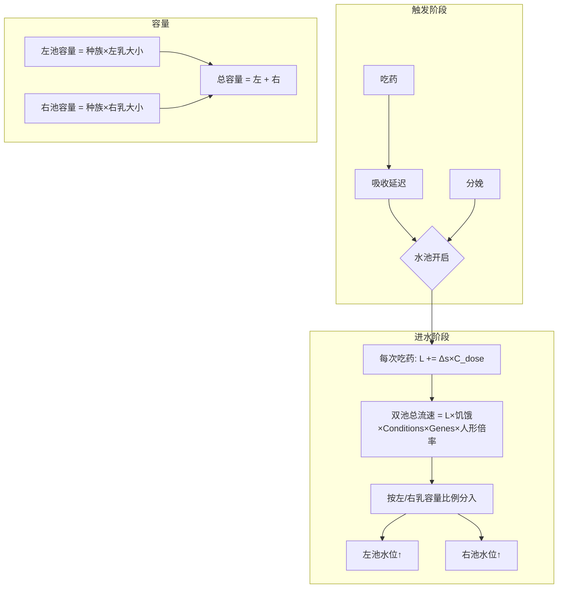
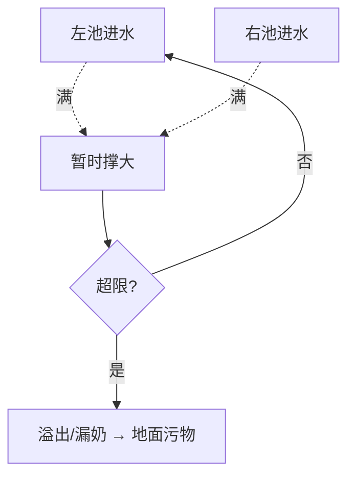

# 泌乳系统逻辑图

本文档以**逻辑图与数据流**形式描述 rjw-cummilk 泌乳系统：从服药/分娩到水池 L、双池、挤奶/吸奶直至泌乳结束。

---

## 一、符号与概念

| 符号/概念 | 含义 |
|-----------|------|
| **L** | 当前泌乳量（唯一状态量），L ≤ 0 时泌乳结束 |
| **E_tol(t)** | 统一耐受系数 = max(1 − 耐受 t, 0.05) |
| **D(L, t)** | 每日衰减 = 1/(B_T×E_tol) + k×L，B_T=3，k=0.01 |
| **双池** | 左乳 / 右乳两个池，总满度 = 左 + 右；进水流速 = L×饥饿系数×流速倍率，**按左右乳容量比例**分入左/右池（非固定 50/50） |
| **吸收延迟** | 服药后由代谢率决定的延迟 tick（基准 15000 tick≈0.25 游戏日，按代谢率 0.25～2 缩放），到点后才挂 Lactating 并进水 |
| **L 结束阈值** | L &lt; ε（LactationEndEpsilon=1E-5）时视为 0 并结束泌乳；永久泌乳基因/动物常开时 L≤0 会重置为 BaseValueTBirth，不结束 |

---

## 二、端到端逻辑链（总览）


**数据流简述：**

- **服药** → outcomeDoers 加 Lactating + 耐受 → Postfix 移除 Lactating，算 t_before、rawSeverity → 入队(endTick) 或立即 Δs = raw×E_tol(t_before)×种族药物倍率 → 到点/立即：GetOrAddHediff(Lactating) + AddFromDrug(Δs) + 心情 → **L 每 200 tick 衰减**；L &lt; ε 或 L≤0 → 移除 Lactating、清双池（永久泌乳/动物常开时 L≤0 则 L 重置为 BaseValueTBirth）→ **双池每 30 tick 由 L 进水**（流速按左右容量比例分配），挤奶/吸奶从双池取。

---

## 三、触发与进水阶段



---

## 四、存在时间（L 驱动）与泌乳结束

```mermaid
flowchart LR
    U[每次吃药: L += Δs×C_dose] --> V[每游戏日: L −= D(L,E)]
    V --> W{L ≤ 0?}
    W -->|是| X[停止进水、清双池、移除 Lactating]
    W -->|否| V
```

- **剩余天数**（仅显示）：≈ L / D(L, E)，不独立存储。
- **实现**：每 200 tick 执行一次衰减；L &lt; LactationEndEpsilon 时先置 0 再判 L≤0；永久泌乳基因或动物常开时，L≤0 不结束、将 L 设为 BaseValueTBirth。

---

## 五、挤奶/吸奶与选侧


- **两侧水位相同时**：**男左女右**（男性 preferLeft=true 先左，女性先右）。代码：`preferLeft = (Pawn.gender == Gender.Male)`，选侧 = 最满一侧，相同时取 preferLeft。

---

## 六、满池处理（撑大与溢出）



- 满池继续进水可暂时超过基础容量（StretchCapFactor）；排水后超出部分每 30 tick 乘 (1 − ShrinkPerStep)×身体健康度，约 0.5 游戏日回缩到基础容量。溢出达阈值生成地面污物（不扣水位）。

---

## 七、数据流总览（输入→计算→输出）

```mermaid
flowchart LR
    subgraph 输入
        X1[当前泌乳量 L]
        X2[耐受 t]
        X3[种族]
        X4[乳房大小]
    end

    subgraph 计算
        Y0[E_tol = max(1−t, 0.05)]
        Y1[吃药: L += Δs×C_dose]
        Y2[每日: L −= D(L,E)；剩余天数 = L/D]
        Y3[容量 = 种族×乳房大小]
    end

    subgraph 输出
        Z1[左池水位]
        Z2[右池水位]
    end

    X1 --> Y1
    X1 --> Y2
    X2 --> Y0
    Y0 --> Y1
    Y0 --> Y2
    X3 --> Y3
    X4 --> Y3
    Y1 --> Z1
    Y1 --> Z2
```

---

## 八、吃药到生效的两种路径


---

## 九、心情与 Hediff 联动（时机）

| 时机 | 行为 |
|------|------|
| 药物生效时（延迟到点 / 立即） | ApplyProlactinMoodEffects：EM_Prolactin_Joy；severity≥2 则挂/刷新 EM_Prolactin_High |
| 挤奶时 | 若药物诱发泌乳且存在 EM_Prolactin_Joy，给生产者 TryGainMemory(EM_Prolactin_Joy) |
| 每 30 tick | ApplyDrugInducedLactationEffects：药物泌乳时挂 EM_DrugLactationBurden、EM_LactatingGain（设置开启时） |

---

## 十、公式与常数

| 符号/名称 | 值 | 说明 |
|-----------|-----|------|
| B_T | 3 | 日衰减分母，参与 D(L,E) |
| k | 0.01 | 负反馈系数 |
| E_min | 0.05 | 耐受系数下限 |
| C_dose | 1 | 剂量转 L 系数 |
| Prolactin 耐受/次 | 0.044 | XML，人类体型 |
| Lucilactin 耐受/次 | 0.176 | XML |
| 耐受日衰减 | -0.015 | XML severityPerDay |
| Prolactin rawSeverity | 0.5 | XML |
| Lucilactin rawSeverity | 2.0 | XML |
| 吸收延迟基准 | 15000 tick（≈0.25 游戏日） | BaseAbsorptionDelayTicks / Clamp(代谢率, 0.25, 2) |
| LactationEndEpsilon | 1E-5 | L &lt; 此值视为 0，泌乳结束 |
| BaseValueTBirth | 10 | 分娩 L 增量；永久泌乳/动物常开且 L≤0 时重置为此值 |

- **进水**：Δs = rawSeverity × E_tol(t_before) × **种族药物倍率**（GetRaceDrugDeltaSMultiplier），ΔL = Δs × C_dose；t_before = 吃药前耐受（本剂在 XML 中于 Lactating 之后加耐受，故 postfix 里用当前耐受减去本剂增量）。
- **双池流速**：总流速 = L × 饥饿系数 × GetMilkFlowMultiplierFromConditions × GetMilkFlowMultiplierFromGenes ×（人形时 defaultFlowMultiplierForHumanlike）；左/右池按 **左乳容量/总容量**、**右乳容量/总容量** 分配（非固定 50/50）。
- **耐受**：完全由原版 ChemicalDef + outcomeDoers + SeverityPerDay 控制，代码只读 t 并算 E_tol。

---

## 十一、相关文档

| 文档 | 内容 |
|------|------|
| [耐受系统重构设计](耐受系统重构设计.md) | 耐受数据来源、统一 E_tol、进水/衰减公式、落地清单 |
| [参数联动表](参数联动表.md) | 设置参数—影响—建议联动、默认值 |
| [游戏已接管变量与机制清单](游戏已接管变量与机制清单.md) | 原版/RJW 已接管变量，本 mod 只读不重写 |
| [耐受水池模拟结果](耐受水池模拟结果.md) | 数值模拟结果与脚本 |
