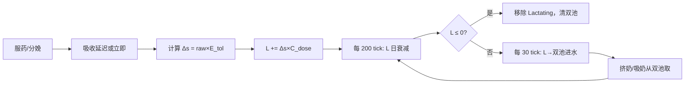
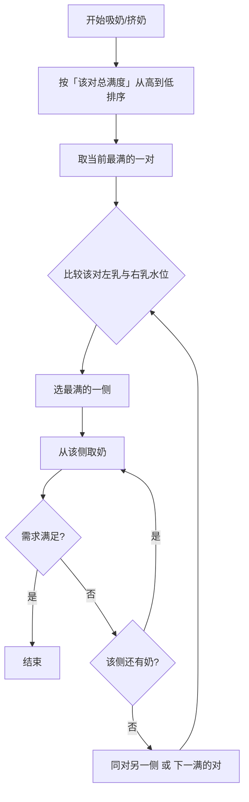
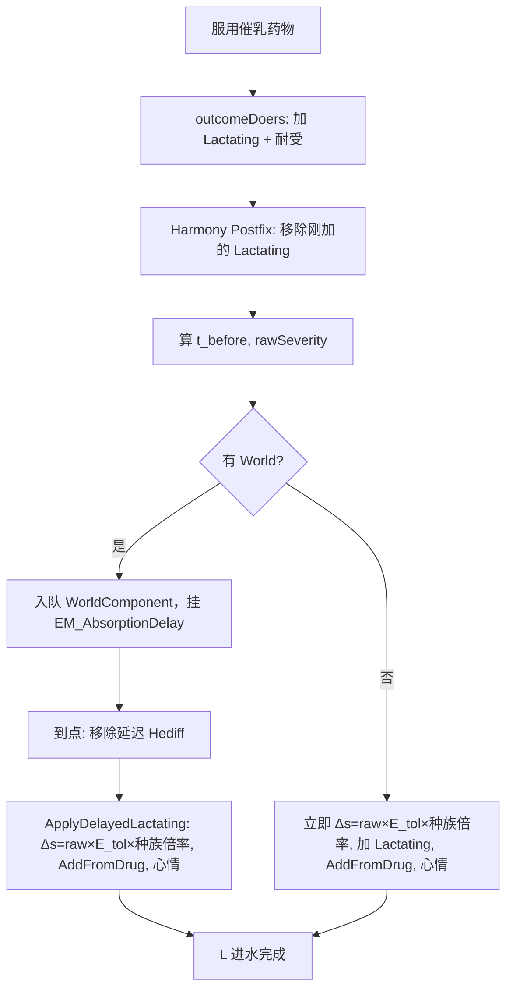

# 泌乳系统逻辑图

本文档以**逻辑图与数据流**形式描述 rjw-cummilk 泌乳系统：从服药/分娩到水池 L、双池、挤奶/吸奶直至泌乳结束。**第二～十一节**描述当前实现的统一行为；**第十二节**为变量定义、公式与可选扩展的参考。

---

## 一、符号与概念

| 符号/概念 | 含义 |
|-----------|------|
| **L** | 当前泌乳量（唯一状态量），L ≤ 0 时泌乳结束 |
| **E_tol(t)** | 统一耐受系数 = max(1 − 耐受 t, 0.05)。实现可选用指数：E_tol = [max(1−t, 0.05)]^exponent（toleranceFlowImpactExponent）；设置 allowToleranceAffectMilk 关闭时恒为 1。 |
| **D(L, E)** | 每日衰减 = 1/(B_T×E) + k×L；**B_T 由设置 baselineMilkDurationDays 反推**（GetEffectiveBaseValueTForDecay），单次剂量时剩余天数≈基准天数；k=0.01 |
| **双池** | 左乳/右乳多对独立池，总满度=所有乳池之和。**结构**：GetBreastPoolEntries 按「每个 hediff = 一对乳房」生成条目：每个 RJW 乳房 hediff 产生 key_L、key_R 两条，同一对共享 PairIndex。**容量**：每个 hediff 的容量 = 该 hediff Severity×容量系数，**同时计入左池与右池**；左池总容量 = 右池总容量 = 所有 hediff 容量之和，总容量 = 2×该和。**流速**：每个 hediff 的 fluidMultiplier **同时计入左、右**；左/右池流速倍率 = 所有 hediff 的 fluidMultiplier 之和；每对条目的 FlowMultiplier 取该 hediff 的完整倍率。**进水**：每 30 tick 按对分组，每对用 LactationPoolState.TickGrowth 进水；**压力 P、喷乳反射 R、状态 Conditions 均按「该乳该侧」**：P_侧 = 该侧满度/该侧撑大容量，R 按 sideKey 存于 letdownReflexByKey，Conditions 按该对对应身体部位（乳腺炎等）取 GetMilkFlowMultiplierFromConditions(part)。**撑大按对**：仅当该对两侧都达基础容量后，该对才允许向 1.2× 撑大。**挤奶/吸奶**：与吸奶共用 DrainForConsume，按对总满度从高到低、每对选较满一侧（相同时先左）扣量，**扣量后仅对被扣的池侧**调用 OnGatheredLetdownByKeys(drainedKeys) 提升该侧 R。未启用 RJW 乳房尺寸时视为一对，左右各 0.5。 |
| **吸收延迟** | 服药后由代谢率决定的延迟 tick（基准 15000 tick≈0.25 游戏日，按代谢率 0.25～2 缩放），到点后才挂 Lactating 并进水 |
| **L 结束阈值** | L &lt; ε（LactationEndEpsilon=1E-5）时视为 0 并结束泌乳；永久泌乳基因/动物常开时 L≤0 会重置为 BaseValueTBirth，不结束 |
| **变量与公式** | R（喷乳反射）、P（压力比例）、I（炎症）、D_eff、PressureFactor、H(L) 等定义与公式见**第十二节**。 |

---

## 二、端到端逻辑链（总览）



**数据流简述：**

- **服药** → outcomeDoers 加 Lactating + 耐受 → Postfix 移除 Lactating，算 t_before、rawSeverity → 入队(endTick) 或立即 Δs = raw×E_tol(t_before)×种族药物倍率 → 到点/立即：GetOrAddHediff(Lactating) + AddFromDrug(Δs) + 心情 → **L 每 200 tick 衰减**（D 可含 η·I，设置开启时）；L &lt; ε 或 L≤0 → 移除 Lactating、清双池（永久泌乳/动物常开时 L≤0 则 L 重置为 BaseValueTBirth）→ **双池每 30 tick 由 L 进水**（**P、R、Conditions 均按「该乳该侧」**：每侧流速 = drive×饥饿×Genes×流速倍率×**Conditions_侧**×**PressureFactor(P_侧)**×**R_侧 倍率**，P_侧=该侧满度/该侧撑大容量，R 按 sideKey 存储与衰减，吸奶/挤奶**仅对被扣量的池侧**调用 AddLetdownReflexStimulus 提升该侧 R；I 每 30 tick 更新，I&gt;I_crit 触发乳腺炎），**挤奶/吸奶**均通过 DrainForConsume 按对总满度从高到低、每对选较满一侧（相同时先左）依次取，drainedKeys 记录被扣侧并传入 OnGatheredLetdownByKeys，仅这些侧 R 升高；L 微幅刺激（设置与上限见第十二节）。

---

## 三、触发与进水阶段

```mermaid
flowchart TB
    subgraph 触发["触发阶段"]
        A[吃药] --> B[吸收延迟]
        B --> C{水池开启}
        D[分娩] --> C
    end

    subgraph 进水["进水阶段"]
        C --> E[每次吃药: L += Δs×C_dose]
        E --> F[按对分组 PairIndex]
        F --> G[每侧流速 = …×Conditions_侧×PressureFactor(P_侧)×R_侧倍率]
        G --> H[每对 TickGrowth 进水；撑大仅当该对两侧都达基础容量]
        H --> L[各左池水位↑]
        H --> R[各右池水位↑]
    end

    subgraph 容量["容量（每个 hediff = 一对）"]
        I[每个 hediff 容量 = Severity×容量系数，同时计入左与右]
        J[左池总容量 = 右池总容量 = 所有 hediff 容量之和]
        K[总容量 = 2×该和]
        I --> J --> K
    end
```

- **流速公式**：每侧流速 = 该侧条目的 FlowMultiplier × flowPerTickScale × **Conditions_侧** × **PressureFactor(P_侧)** × **R_侧 倍率**；flowPerTickScale = (drive×饥饿×Genes×流速倍率)/日 × (30/60000)。drive 默认取 L；设置开启激素饱和时取 D_eff。**P_侧** = 该侧满度/该侧撑大容量（1.2×基础容量）。**Conditions_侧**：GetMilkFlowMultiplierFromConditions(该对对应身体部位)，仅该部位有乳腺炎时该侧惩罚。**R_侧**：按 sideKey（如 poolKey_L）存于 letdownReflexByKey；吸奶/挤奶**仅对被扣量的侧** AddLetdownReflexStimulus(sideKey)，R 每 30 tick 统一衰减。公式与参数见第十二节。


---

## 四、存在时间（L 驱动）与泌乳结束

```mermaid
flowchart LR
    U[每次吃药: L += Δs×C_dose] --> V[每游戏日: L −= D(L,E)]
    V --> W{L ≤ 0?}
    W -->|是| X[停止进水、清双池、移除 Lactating]
    W -->|否| V
```

- **剩余天数**（仅显示）：≈ L / D(L, E)，不独立存储。D 中的 B_T 由设置「药物泌乳基准持续天数」反推。
- **实现**：每 200 tick 执行一次衰减；L &lt; LactationEndEpsilon 时先置 0 再判 L≤0；永久泌乳基因或动物常开时，L≤0 不结束、将 L 设为 BaseValueTBirth。
- **L 衰减公式**：D = 1/(B_T·E) + k·L；设置开启炎症模型时 D 增加 **η·I**，炎症加速泌乳终止。

---

## 五、挤奶/吸奶与选侧



- **挤奶（Gathered）**：与吸奶共用 DrainForConsume 逻辑。**按「哪对最满」优先**（该对左+右总满度高的先扣），每对内先选较满一侧扣量，不够再扣同对另一侧、再扣下一对（按满度排序），直至取满当次需求量或池空；DrainForConsume 的 drainedKeys 记录本次被扣的池侧 key，再调用 OnGatheredLetdownByKeys(drainedKeys)，**仅这些被扣侧** R 升高（AddLetdownReflexStimulus）；L 微幅刺激（有单次/每日上限），P 随 Drain 自然降低。
- **吸奶（GreedyConsume）**：DrainForConsume 同样按**对总满度从高到低**排序后依次扣，每对内先选较满一侧，不够再同对另一侧、再下一对，直至扣够 desiredCharge 或池空；drainedKeys 传入 OnGatheredLetdownByKeys，**仅被扣侧** R 升高；SyncChargeFromPool 同步 Charge，L 微幅刺激同上。
- **两侧水位相同时**：**先左**（与性别/变性/无性别种族无关）。代码：`preferLeft = true`。

---

## 六、满池处理（撑大与溢出）

- **压力软抑制**（当前实现）：**按侧**计算，每侧流速乘 **PressureFactor(P_侧)**，**P_侧 = 该侧满度/该侧撑大容量**（该侧基础容量×StretchCapFactor）。Pc=0.9、b=25～40；90% 前≈1，95% 后急剧降，满则不低于 pressureFactorMin。UpdateMilkPools 每侧用 GetPressureFactor(curLeft/stretchLeft) 等自然抑制该侧流速，不截断 L。撑大、胀满 hediff、满池计数仍正常；回缩每 30 tick 仍执行。
- **回缩吸收**：回缩时超出基础容量的部分（未溢出）视为被身体吸收，按 `GetReabsorbedNutritionPerDay()` 折算为每日补充营养，由 Need_Food 补丁加回饱食度；可设置开关与效率（0~1），悬停显示「回缩吸收：+X 营养/天」。
- **撑大（按对）**：每对独立判定。仅当**该对两侧都达到基础容量**（左≥左基础容量且右≥右基础容量）后，该对才允许总水位超过基础总容量，向撑大上限（单侧 1.2×基础容量）继续进水；否则该对只填到基础容量，富余流速填入该对另一侧或溢出。实现：UpdateMilkPools 按 PairIndex 分组，每对调用 LactationPoolState.TickGrowth。
- 撑大后超出基础容量的部分，排水后每 30 tick 乘 (1−ShrinkPerStep)×身体健康度，约 0.5 游戏日回缩到基础容量。
- **溢出**：超过撑大上限的部分计入溢出，累计达阈值生成地面污物（不扣水位）。
- **单乳/单侧**：某对仅一侧有容量时，该对按单侧进水（SingleBreastTickGrowth）；单侧满到基础容量后即可撑大。
- **一侧满（未达两侧都满）**：该侧不再进，本 tick 流速全部加到同对另一侧；仅当另一侧也填到基础容量后，才允许该对撑大。

---

## 七、UI 显示

| 位置 | 显示内容 | 实现 |
|------|----------|------|
| **哺乳期 hediff 悬停**（Lactating） | **总奶量 / 总容量**（EM.PoolTotalMilkCapacity）；设置开启质量时显示**乳汁质量**（EM.MilkQuality） | HediffWithComps_EqualMilkingLactating.CompTipStringExtra |
| **健康页每个乳房 hediff 悬停** | 该乳所在**该对**的「左乳：奶量/容量，右乳：奶量/容量」；该对**产奶效率**（总、左、右）及**按侧因子行**（驱动×饥饿×**状态_侧**×基因×设置×左/右乳×**压力_侧**×**喷乳反射_侧**） | Milking.Hediff_TipString_BreastPool_Patch、HealthCardUtility_GetTooltip_BreastPool_Patch；GetFlowPerDayForBreastPair、GetPressureFactorForSide、GetConditionsForSide；BuildBreastEfficiencyFactorLine 传入 conditionsForSide / pressureForSide / letdownForSide |

- 哺乳期不展示各乳/各对明细，避免信息过载；健康页查看具体乳房时再展示该对双池及**按该侧**的状态、压力、喷乳反射因子。

---

## 八、数据流总览（输入→计算→输出）

```mermaid
flowchart LR
    subgraph 输入
        X1[当前泌乳量 L]
        X2[耐受 t]
        X3[种族]
        X4[乳房大小]
    end

    subgraph 计算
        Y0[E_tol = max(1−t, 0.05)；可选^exponent]
        Y1[吃药: L += Δs×C_dose]
        Y2[每日: L −= D(L,E)；剩余天数 = L/D]
        Y3[容量 = 种族×乳房大小]
    end

    subgraph 输出
        Z1[左池水位]
        Z2[右池水位]
    end

    X1 --> Y1
    X1 --> Y2
    X2 --> Y0
    Y0 --> Y1
    Y0 --> Y2
    X3 --> Y3
    X4 --> Y3
    Y1 --> Z1
    Y1 --> Z2
```

- 流速 = 按侧求和：每侧 = drive×饥饿×Genes×流速倍率×**Conditions_侧**×**PressureFactor(P_侧)**×**R_侧 倍率**；D 可含 η·I。R/P/Conditions 均按「该乳该侧」，变量与公式见**第十二节**。

---

## 九、吃药到生效的两种路径



---

## 十、心情与 Hediff 联动（时机）

| 时机 | 行为 |
|------|------|
| 药物生效时（延迟到点 / 立即） | ApplyProlactinMoodEffects：EM_Prolactin_Joy；severity≥2 则挂/刷新 EM_Prolactin_High |
| 挤奶时 | 若药物诱发泌乳且存在 EM_Prolactin_Joy，给生产者 TryGainMemory(EM_Prolactin_Joy) |
| 每 30 tick | ApplyDrugInducedLactationEffects：药物泌乳时挂 EM_DrugLactationBurden、EM_LactatingGain（设置开启时） |

---

## 十一、公式与常数

| 符号/名称 | 值 | 说明 |
|-----------|-----|------|
| B_T | 由设置反推 | **baselineMilkDurationDays** 参与衰减：GetEffectiveBaseValueTForDecay() = 1/(0.5/baseline − k×0.5)；**默认 5** 时 B_T≈10.5，单次剂量剩余天数≈约 5 日 |
| k | 0.01 | 负反馈系数 |
| E_min | 0.05 | 耐受系数下限；E_tol = max(1−t, E_min) |
| E_tol 指数 / 开关 | 可选 | 实现支持 E_tol = [max(1−t, 0.05)]^exponent（toleranceFlowImpactExponent）；allowToleranceAffectMilk 关闭时 E_tol 恒为 1 |
| C_dose | 1 | 剂量转 L 系数 |
| Prolactin 耐受/次 | 0.044 | XML，人类体型 |
| Lucilactin 耐受/次 | 0.176 | XML |
| 耐受日衰减 | -0.015 | XML severityPerDay |
| Prolactin rawSeverity | 0.5 | XML |
| Lucilactin rawSeverity | 2.0 | XML |
| 吸收延迟基准 | 15000 tick（≈0.25 游戏日） | BaseAbsorptionDelayTicks / Clamp(代谢率, 0.25, 2) |
| LactationEndEpsilon | 1E-5 | L &lt; 此值视为 0，泌乳结束 |
| BaseValueTBirth | 10 | 分娩 L 增量；永久泌乳/动物常开且 L≤0 时重置为此值 |

- **进水**：Δs = rawSeverity × E_tol(t_before) × **种族药物倍率**（GetRaceDrugDeltaSMultiplier），ΔL = Δs × C_dose；t_before = 吃药前耐受（本剂在 XML 中于 Lactating 之后加耐受，故 postfix 里用当前耐受减去本剂增量）。
- **双池流速**：**每个 hediff 表示一对乳房**，该 hediff 的 fluidMultiplier **同时计入左、右**。左池流速倍率 = 右池流速倍率 = 所有 hediff 的 fluidMultiplier 之和（GetMilkFlowMultipliersFromRJW）。每对池条目的 FlowMultiplier 取该 hediff 的完整倍率（不折半）。**左池流速** = 左池流速倍率 × **drive** × 饥饿系数 × Conditions × Genes × 流速倍率 × **R** × **PressureFactor(P)**；**右池流速** 同理。drive 默认 L，设置开启激素饱和时为 D_eff=L·H(L)。总产乳/天 = 左池流速 + 右池流速。未启用 rjwBreastSizeEnabled 时左右流速倍率均为 0.5（总 1）。
- **双池容量**：**每个 hediff 表示一对**。每个 hediff 的容量 = Clamp(Severity×容量系数, 0, 10)，**同时计入左池与右池**。左池总容量 = 右池总容量 = 所有 hediff 容量之和；总容量 = 2×该和。单乳（1 个 hediff）时：左容量 = 右容量 = Severity×系数，总容量 = 2×(Severity×系数)。多 hediff 时：左/右均为各 hediff 容量之和，总容量 = 2×该和。无 RJW / 未开启「RJW 乳房」/ 列表为空时使用人类默认容量（单侧 0.5、总 1）。
  - **Conditions**：**按身体部位**（GetMilkFlowMultiplierFromConditions(part)）；part 为该对乳房 hediff 的 Part，仅该部位有乳腺炎时该侧惩罚，无问题=1，最低 0.5。
  - **Genes**：rjw-genes 基因加成（如大胸/多乳），无=1，Clamp 0.5～1.5。
  - **RJW**：每个 hediff 的 HediffDef_SexPart.fluidMultiplier（Clamp 0.1～3）同时计入左、右流速倍率；GetBreastPoolEntries 为每对生成的 _L/_R 条目使用该 hediff 的完整 fluidMultiplier。未启用 rjwBreastSizeEnabled 时左右流速倍率均为 0.5。
  - **流速倍率**：设置滑块 defaultFlowMultiplierForHumanlike，范围 0.25～2，默认 2（单次剂量约 1 日灌满）。
- **耐受**：完全由原版 ChemicalDef + outcomeDoers + SeverityPerDay 控制，代码只读 t 并算 E_tol。E_tol 可实现为 [max(1−t, 0.05)]^exponent（设置 toleranceFlowImpactExponent），allowToleranceAffectMilk 关闭时恒为 1。
- **R（按侧）、P（按侧）、Conditions（按部位）、I、PressureFactor、η、H(L)、D_eff、MilkQuality、组织适应**等常数与公式见**第十二节**。

---

## 十一（补）、能耗 / 产量 / 哺乳期效率 系数与属性

| 名称 | 是什么 | 在哪里用 | 实际作用 |
|------|--------|----------|----------|
| **泌乳额外营养系数（能耗消耗系数）** | 设置 `lactationExtraNutritionBasis`，滑块 0～300，150=1:1 | Need_Food 补丁：`factor = basis/150`，`extraFall = flowPerDay × factor × (150/60000)`；回缩吸收同样乘 `factor` | **泌乳时额外饱食度扣除的全局倍率**。150 = 按流速换算的营养 1:1 扣；0 = 不扣；300 = 扣两倍。也同倍率放大回缩吸收的加回。**与「流速倍率」不是同一代码、不重复**：流速倍率（defaultFlowMultiplierForHumanlike）在 GetFlowPerDay/UpdateMilkPools 里控制**池子进水流速**；能耗系数在 Need_NeedInterval 补丁里控制**按流速扣多少饱食度**。一个管「灌多快」，一个管「扣多少饿」。 |
| ~~产量属性乘数（MilkAmount / EM_Milk_Amount_Factor）~~ | **已删除**。原为种族 milkAmount × Stat 倍率 | — | 产出已 1 池单位→1 份奶；仅保留种族 milkAmount 作为每次挤奶可排池单位上限（ResourceAmount），不再有 Stat 乘数。 |
| ~~哺乳期效率属性乘数（MilkGrowthMultiplier / EM_Lactating_Efficiency_Factor）~~ | **已删除**。原仅用于悬停「倍率」显示 | — | 池子流速已用 BodyResourceGrowthSpeed + Conditions/Genes，无需单独效率 Stat。 |

---

## 十二、变量定义与公式参考（四层模型）

本节集中定义第二～十一节所用变量与公式（R、P、I、D_eff、PressureFactor、H(L) 等），**均已实现且默认开启**；可在 Mod 设置中关闭各层。L 为唯一长期主状态，R/P/I 为快/中速状态，时间尺度分离，无循环发散。

### 12.1 模型概览

| 层次 | 含义 |
|------|------|
| L | 泌乳激素综合水平（主驱动力）；可选经 H(L) 饱和后为 D_eff 驱动流速 |
| P | **按侧**压力比例 P_侧 = 该侧满度/该侧撑大容量；PressureFactor(P_侧) 软抑制该侧流速 |
| R | **按侧**喷乳反射（letdownReflexByKey[sideKey]）；仅被挤奶/吸奶的池侧受刺激升高，各侧独立衰减 |
| C（Conditions） | **按部位**状态（如乳腺炎）；GetMilkFlowMultiplierFromConditions(该对 Part)，仅该部位有乳腺炎时该侧惩罚 |
| I | 炎症负荷；动态累积，触发乳腺炎并参与 L 衰减（η·I）|

### 12.2 变量定义

| 类型 | 变量 | 范围/定义 | 时间尺度 |
|------|------|-----------|----------|
| **慢变量** | L(t) ≥ 0 | 泌乳激素综合水平（主驱动力） | 天 |
| **中速变量** | I(t) ≥ 0 | 炎症负荷 | 小时 |
| **快变量** | R_侧(t) ∈ [0, 1] | 喷乳反射敏感度，**按 sideKey 存储**（letdownReflexByKey） | 分钟 |
| **派生变量** | P_侧(t) = F_侧(t) / F_侧_max | **按侧**压力比例；F_侧 = 该侧满度，F_侧_max = 该侧撑大容量（1.2×基础容量） | 分钟 |
| **按部位** | C_侧 | 状态（乳腺炎等），GetMilkFlowMultiplierFromConditions(该对 Part)，仅该部位有则该侧惩罚 | 分钟 |

### 12.3 激素层（Hormone Layer）

- **非线性驱动函数**（避免线性爆炸）  
  **H(L) = 1 − exp(−a·L)**，a &gt; 0（建议 0.5～1.5）。  
- **有效驱动力**（默认带参考值归一，尾期更平滑）  
  **D_eff = L · (1−e^{−aL}) / (1−e^{−aL_ref})**；L_ref &gt; 0 时在参考点归一，低 L 时相对未归一公式灌池更平滑，避免「突然没奶」感。L_ref ≤ 0 时退化为 **D_eff = L · H(L)**。  
- **性质**：小 L 时 D_eff 仍随 L 上升但曲线被整体缩放，大 L 渐近线性。默认流速由 D_eff 驱动，**enableHormoneSaturation** 可关闭；**hormoneSaturationLRef** 控制参考 L（默认 1）。

### 12.4 反射层（Let-down Reflex）

- **连续衰减**  
  **dR/dt = −λ·R**。  
- **离散实现**  
  **R_{t+Δt} = R_t · exp(−λ·Δt)**。建议 λ = 0.02～0.05（每分钟）。  
- **加成模式**（**letdownReflexBoostMultiplier** &gt; 1，默认 2）  
  - 吸奶/挤奶时 **R 升高**（+ΔR，R ≤ 1）；之后 R 随时间衰减，**可衰减到 0**（R 无下限）。  
  - **进水流速倍率** = **1 + R×(boost−1)**：**R=0 时倍率为 1**（正常进水），R=1 时为 boost 倍（如 1.5～2.5）。**倍率最低为 1，不会变成 0**。  
  - **效果**：被吸奶/挤奶后，进水量在 boost 倍水平维持一段时间（由 λ 决定衰减快慢），随后逐渐回到 1 倍。  
- **旧模式**（boost ≤ 1）  
  流速 × R，R 有下限 **letdownReflexMin**（默认 0.25），避免无刺激时产奶归零。  
- **事件触发**  
  挤奶/吸奶：DrainForConsume 记录 **drainedKeys**（本次被扣量的池侧），**仅对这些 sideKey** 调用 AddLetdownReflexStimulus(sideKey)，**R_侧 ← R_侧 + ΔR**，Clamp 至 1。建议 ΔR = 0.3～0.6。未受刺激的侧 R 不变。

### 12.5 压力层（Pressure Model）

- **软抑制**（替代当前满池硬停）  
  **PressureFactor(P) = 1 / (1 + exp(b·(P − Pc)))**  
  参数：**Pc = 0.9**，**b = 25～40**。  
- **压力因子下限**  
  设置 **pressureFactorMin**（默认 0.15）：满池时 PressureFactor **不低于此值**，保证仍有进水流速，撑大与溢出仍能发生；设为 0 则满池时压到接近 0（溢出几乎不起作用）。  
  - **粗算**：Pc=0.9、b=30 时，P=1 时 PF_raw = 1/(1+exp(3)) ≈ 0.047；设下限 0.15 后满池仍保留 15% 流速，溢出可累积并触发污物（OverflowFilthThreshold=0.02）。建议 0.05～0.15。  
- **性质**：90% 前几乎无影响；95% 后急剧下降；满池时不低于下限（如 10%），溢出/污物可触发。  
- **P_侧**：**P_侧(t) = F_侧(t) / F_侧_max**，F_侧 = 该侧当前满度，F_侧_max = 该侧撑大容量（基础容量×StretchCapFactor）。实现：UpdateMilkPools / GetPressureFactorForSide 按 sideKey 计算。

### 12.6 乳汁生成流速方程

- **总流速**  
  **Flow(t) = Σ_侧** [ base × **C_侧** × **PressureFactor(P_侧)** × **R_侧 倍率** × FlowMultiplier_侧 ]，base = drive × H_hunger × G × 流速倍率（含 Setting）。  
  - **C_侧**：GetMilkFlowMultiplierFromConditions(该对 Part)，按部位。  
  - **R_侧 倍率**：加成模式（boost&gt;1）时为 **1 + R_侧×(boost−1)**；旧模式时为 **R_侧**（含 letdownReflexMin 下限）。  
- **按侧分配**：实现上**每条目（每侧）独立**——该侧流速 = FlowMultiplier × flowPerTickScale × C_侧 × PressureFactor(P_侧) × R_侧 倍率。同对左右共享该 hediff 的 FlowMultiplier，但 P_侧、R_侧、C_侧（若该对 Part 有乳腺炎）可不同。多对时各对条目同上，总流速为所有侧之和。

### 12.7 池子更新方程

- **F(t+Δt) = F(t) + Flow·Δt − Drain**  
  限制 **0 ≤ F ≤ F_max**。  
- **若 F ≥ F_max**：不截断 L，仅由 PressureFactor 自然抑制流速（软停流）。

### 12.8 炎症动态模型（Inflammation）

- **累积**  
  **dI/dt = α·P² + β·Injury + γ·BadHygiene − ρ·I**  
  其中：α = 压力影响，β = 伤口系数，γ = 卫生系数，ρ = 自然恢复率。  
- **离散**  
  **I_{t+Δt} = I_t + Δt·(α·P² + β·Injury + γ·BadHygiene − ρ·I_t)**，限制 I ≥ 0。  
- **乳腺炎触发**  
  **if I &gt; I_crit ⇒ Mastitis**。可设 I_crit = 1.0。设置 **enableMilkQuality** 时有效 I_crit 随乳汁质量提高。

### 12.9 激素衰减升级（L 衰减）

- **原模型**  
  D(L,E) = 1/(B_T·E) + k·L。  
- **升级**  
  **dL/dt = −(1/(B_T·E) + k·L + η·I)**  
  新增 **η** = 炎症抑制因子：炎症加速泌乳终止。设置 **enableInflammationModel** 开启时 D 含 η·I。

### 12.10 挤奶真实化

- 挤奶/吸奶时：**仅对被扣量的池侧提高 R_侧**（OnGatheredLetdownByKeys(drainedKeys) → AddLetdownReflexStimulus(sideKey)）；**降低 P_侧**（Drain 减该侧池）；**微幅提高 L**（短期刺激 **L += tinyStimulus**），设置上限，防止无限循环。

### 12.11 扩展机制（默认开启）

- **耐受动态**：dE/dt = μ·L − ν·E；mod 维护有效耐受 E，用于流速/衰减的 E_tol。默认开启，**enableToleranceDynamic** 可关闭；μ、ν 为 **toleranceDynamicMu/Nu**（每游戏日）。  
- **组织适应**：长期高 P 时 dF_max/dt = θ·max(P−0.85, 0) − ω·(1−P)；默认开启，**enableTissueAdaptation** 可关闭。  
- **MilkQuality**：MilkQuality = f(Hunger, I)，影响乳腺炎阈值与悬停显示；默认开启，**enableMilkQuality** 可关闭。

### 12.12 系统时间尺度分离

| 变量 | 时间尺度 |
|------|----------|
| R_侧 | 分钟（按 sideKey 独立） |
| P_侧 | 分钟（派生，按侧） |
| C_侧 | 分钟（按部位，随 hediff 状态） |
| I | 小时 |
| L | 天 |
| F_max | 天（若做组织适应） |

保证：无振荡、无数值爆炸、无自激循环。新增约 3 个 float，每 30 tick 更新，性能影响极小。

### 12.13 实现与参数

上述公式与变量均已实现，**压力/反射/炎症/激素饱和/组织适应/质量均默认开启**，可在 Mod 设置中关闭。参数与分阶段历史见 [四层模型升级-代码待办](四层模型升级-代码待办.md)。

---

## 十三、相关文档

| 文档 | 内容 |
|------|------|
| [乳房容量模拟计算](乳房容量模拟计算.md) | 容量/流速公式（每个 hediff=一对）、示例计算、产乳逻辑 |
| [耐受系统重构设计](耐受系统重构设计.md) | 耐受数据来源、统一 E_tol、进水/衰减公式、落地清单 |
| [参数联动表](参数联动表.md) | 设置参数—影响—建议联动、默认值 |
| [游戏已接管变量与机制清单](游戏已接管变量与机制清单.md) | 原版/RJW 已接管变量，本 mod 只读不重写 |
| [耐受水池模拟结果](耐受水池模拟结果.md) | 数值模拟结果与脚本 |
| [泌乳系统逻辑图-代码审计](泌乳系统逻辑图-代码审计.md) | 本文档与当前源码的逐项对照与差异汇总 |
| [四层模型升级-代码待办](四层模型升级-代码待办.md) | 第十二节公式与参数对应的实现清单与历史分阶段 |
